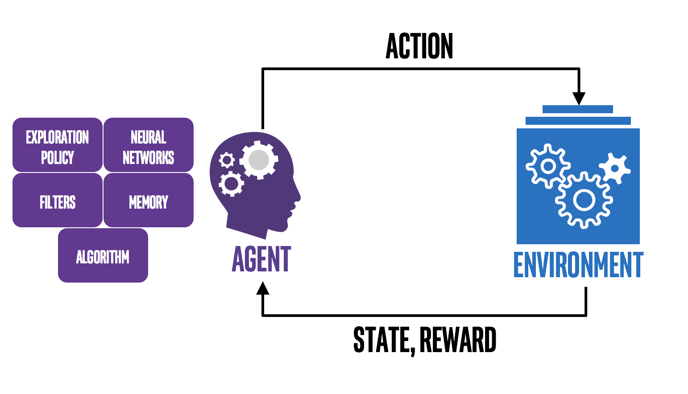

# Awesome-Reinforcement-Learning-Papers

  

Welcome to our GitHub repository! This repository is dedicated to curating significant research papers in the field of **Reinforcement Learning (RL)** that have been accepted at top academic conferences such as **AAAI**, **IJCAI**, **NeurIPS**, **ICML**, **ICLR**, **ICRA**, **AAMAS** and more. We provide you with a convenient resource hub to help you stay updated on the latest developments in reinforcement learning, delve into research trends, and explore cutting-edge algorithms and methods.

欢迎来到我们的GitHub仓库！这个仓库致力于记录 **强化学习** 领域在顶级学术会议，如：**AAAI**, **IJCAI**, **NeurIPS**, **ICML**, **ICLR**, **ICRA**, **AAMAS** 等录用的重要研究论文。我们为您提供了一个便捷的资源库，以帮助您跟踪最新的强化学习进展，深入了解领域内的研究趋势，并探讨最前沿的算法和方法。

## News

- 2023/8/19: I added papers accepted at AAMAS'23, IJCAI'23, ICRA'23, ICML-23,ICLR'23, AAAI'23, NeurIPS'22 etc
- 2023/1/6: I created the repository.

## Contributing

  

Please help to contribute this list by contacting me or add pull request.

## Table of Contents

- [Conferences in 2023](#Conferences-in-2023)

  - [2023-AAAI](#2023-AAAI)
  - [2023-AAMAS](#2023-AAMAS)
  - [2023-ICLR](#2023-ICLR)
  - [2023-ICML](#2023-ICML)
  - [2023-ICRA](#2023-ICRA)

  - [2023-IJCAI](#2023-IJCAI)

- [2022](#2022)

- [2021](#2021)

- [2020](#2020)

- [2019](#2019)

- [2018](#2018)

- [2017](#2017)

## Conferences in 2023

### 2023-AAAI

> Thirty-Seventh AAAI Conference on Artificial Intelligence, AAAI 2023, Washington, DC, USA, February 7-14, 2023.

**Accepted Papers：**

 - **Siamese-Discriminant Deep Reinforcement Learning for Solving Jigsaw Puzzles with Large Eroded Gaps.** [[pdf](https://doi.org/10.1609/aaai.v37i2.25325)]
   - Xingke Song, Jiahuan Jin, Chenglin Yao, Shihe Wang, Jianfeng Ren, Ruibin Bai.
 - **RLogist: Fast Observation Strategy on Whole-Slide Images with Deep Reinforcement Learning.** [[pdf](https://doi.org/10.1609/aaai.v37i3.25467)]
   - Boxuan Zhao, Jun Zhang, Deheng Ye, Jian Cao, Xiao Han, Qiang Fu, Wei Yang.
 - **Reinforcement Learning for Branch-and-Bound Optimisation Using Retrospective Trajectories.** [[pdf](https://doi.org/10.1609/aaai.v37i4.25521)]
   - Christopher W. F. Parsonson, Alexandre Laterre, Thomas D. Barrett.
 - **End-to-End Entity Linking with Hierarchical Reinforcement Learning.** [[pdf](https://doi.org/10.1609/aaai.v37i4.25534)]
   - Lihan Chen, Tinghui Zhu, Jingping Liu, Jiaqing Liang, Yanghua Xiao.
 - **Let Graph Be the Go Board: Gradient-Free Node Injection Attack for Graph Neural Networks via Reinforcement Learning.** [[pdf](https://doi.org/10.1609/aaai.v37i4.25558)]
   - Mingxuan Ju, Yujie Fan, Chuxu Zhang, Yanfang Ye.
 - **AdapSafe: Adaptive and Safe-Certified Deep Reinforcement Learning-Based Frequency Control for Carbon-Neutral Power Systems.** [[pdf](https://doi.org/10.1609/aaai.v37i4.25660)]
   - Xu Wan, Mingyang Sun, Boli Chen, Zhongda Chu, Fei Teng.
 - **An Efficient Deep Reinforcement Learning Algorithm for Solving Imperfect Information Extensive-Form Games.** [[pdf](https://doi.org/10.1609/aaai.v37i5.25722)]
   - Linjian Meng, Zhenxing Ge, Pinzhuo Tian, Bo An, Yang Gao.
 - **Utilizing Prior Solutions for Reward Shaping and Composition in Entropy-Regularized Reinforcement Learning.** [[pdf](https://doi.org/10.1609/aaai.v37i6.25817)]
   - Jacob Adamczyk, Argenis Arriojas, Stas Tiomkin, Rahul V. Kulkarni.
 - **PiCor: Multi-Task Deep Reinforcement Learning with Policy Correction.** [[pdf](https://doi.org/10.1609/aaai.v37i6.25825)]
   - Fengshuo Bai, Hongming Zhang, Tianyang Tao, Zhiheng Wu, Yanna Wang, Bo Xu.
 - **Achieving Zero Constraint Violation for Constrained Reinforcement Learning via Conservative Natural Policy Gradient Primal-Dual Algorithm.** [[pdf](https://doi.org/10.1609/aaai.v37i6.25826)]
   - Qinbo Bai, Amrit Singh Bedi, Vaneet Aggarwal.
 - **RePreM: Representation Pre-training with Masked Model for Reinforcement Learning.** [[pdf](https://doi.org/10.1609/aaai.v37i6.25842)]
   - Yuanying Cai, Chuheng Zhang, Wei Shen, Xuyun Zhang, Wenjie Ruan, Longbo Huang.
 - **Learning Pessimism for Reinforcement Learning.** [[pdf](https://doi.org/10.1609/aaai.v37i6.25852)]
   - Edoardo Cetin, Oya Çeliktutan.
 - **Posterior Coreset Construction with Kernelized Stein Discrepancy for Model-Based Reinforcement Learning.** [[pdf](https://doi.org/10.1609/aaai.v37i6.25853)]
   - Souradip Chakraborty, Amrit Singh Bedi, Pratap Tokekar, Alec Koppel, Brian M. Sadler, Furong Huang, Dinesh Manocha.
 - **Offline Quantum Reinforcement Learning in a Conservative Manner.** [[pdf](https://doi.org/10.1609/aaai.v37i6.25872)]
   - Zhihao Cheng, Kaining Zhang, Li Shen, Dacheng Tao.
 - **Augmented Proximal Policy Optimization for Safe Reinforcement Learning.** [[pdf](https://doi.org/10.1609/aaai.v37i6.25888)]
   - Juntao Dai, Jiaming Ji, Long Yang, Qian Zheng, Gang Pan.
 - **Incremental Reinforcement Learning with Dual-Adaptive ε-Greedy Exploration.** [[pdf](https://doi.org/10.1609/aaai.v37i6.25899)]
   - Wei Ding, Siyang Jiang, Hsi-Wen Chen, Ming-Syan Chen.
 - **Provably Efficient Primal-Dual Reinforcement Learning for CMDPs with Non-stationary Objectives and Constraints.** [[pdf](https://doi.org/10.1609/aaai.v37i6.25900)]
   - Yuhao Ding, Javad Lavaei.
 - **Non-stationary Risk-Sensitive Reinforcement Learning: Near-Optimal Dynamic Regret, Adaptive Detection, and Separation Design.** [[pdf](https://doi.org/10.1609/aaai.v37i6.25901)]
   - Yuhao Ding, Ming Jin, Javad Lavaei.
 - **Model-Based Offline Reinforcement Learning with Local Misspecification.** [[pdf](https://doi.org/10.1609/aaai.v37i6.25903)]
   - Kefan Dong, Yannis Flet-Berliac, Allen Nie, Emma Brunskill.
 - **Fast Counterfactual Inference for History-Based Reinforcement Learning.** [[pdf](https://doi.org/10.1609/aaai.v37i6.25924)]
   - Haichuan Gao, Tianren Zhang, Zhile Yang, Yuqing Guo, Jinsheng Ren, Shangqi Guo, Feng Chen.
 - **Dream to Generalize: Zero-Shot Model-Based Reinforcement Learning for Unseen Visual Distractions.** [[pdf](https://doi.org/10.1609/aaai.v37i6.25945)]
   - Jeongsoo Ha, Kyungsoo Kim, Yusung Kim.
 - **Model-Based Reinforcement Learning with Multinomial Logistic Function Approximation.** [[pdf](https://doi.org/10.1609/aaai.v37i7.25964)]
   - Taehyun Hwang, Min-hwan Oh.
 - **Online Tuning for Offline Decentralized Multi-Agent Reinforcement Learning.** [[pdf](https://doi.org/10.1609/aaai.v37i7.25973)]
   - Jiechuan Jiang, Zongqing Lu.
 - **On the Sample Complexity of Vanilla Model-Based Offline Reinforcement Learning with Dependent Samples.** [[pdf](https://doi.org/10.1609/aaai.v37i7.25989)]
   - Mustafa O. Karabag, Ufuk Topcu.
 - **Adversarial Robust Deep Reinforcement Learning Requires Redefining Robustness.** [[pdf](https://doi.org/10.1609/aaai.v37i7.26009)]
   - Ezgi Korkmaz.
 - **FanoutNet: A Neuralized PCB Fanout Automation Method Using Deep Reinforcement Learning.** [[pdf](https://doi.org/10.1609/aaai.v37i7.26030)]
   - Haiyun Li, Jixin Zhang, Ning Xu, Mingyu Liu.
 - **SplitNet: A Reinforcement Learning Based Sequence Splitting Method for the MinMax Multiple Travelling Salesman Problem.** [[pdf](https://doi.org/10.1609/aaai.v37i7.26049)]
   - Hebin Liang, Yi Ma, Zilin Cao, Tianyang Liu, Fei Ni, Zhigang Li, Jianye Hao.
 - **Policy-Independent Behavioral Metric-Based Representation for Deep Reinforcement Learning.** [[pdf](https://doi.org/10.1609/aaai.v37i7.26052)]
   - Weijian Liao, Zongzhang Zhang, Yang Yu.
 - **Metric Residual Network for Sample Efficient Goal-Conditioned Reinforcement Learning.** [[pdf](https://doi.org/10.1609/aaai.v37i7.26058)]
   - Bo Liu, Yihao Feng, Qiang Liu, Peter Stone.
 - **Robust Representation Learning by Clustering with Bisimulation Metrics for Visual Reinforcement Learning with Distractions.** [[pdf](https://doi.org/10.1609/aaai.v37i7.26063)]
   - Qiyuan Liu, Qi Zhou, Rui Yang, Jie Wang.
 - **Local Explanations for Reinforcement Learning.** [[pdf](https://doi.org/10.1609/aaai.v37i7.26081)]
   - Ronny Luss, Amit Dhurandhar, Miao Liu.
 - **Online Reinforcement Learning with Uncertain Episode Lengths.** [[pdf](https://doi.org/10.1609/aaai.v37i7.26088)]
   - Debmalya Mandal, Goran Radanovic, Jiarui Gan, Adish Singla, Rupak Majumdar.
 - **Provably Efficient Causal Model-Based Reinforcement Learning for Systematic Generalization.** [[pdf](https://doi.org/10.1609/aaai.v37i8.26109)]
   - Mirco Mutti, Riccardo De Santi, Emanuele Rossi, Juan Felipe Calderón, Michael M. Bronstein, Marcello Restelli.
 - **On Instance-Dependent Bounds for Offline Reinforcement Learning with Linear Function Approximation.** [[pdf](https://doi.org/10.1609/aaai.v37i8.26116)]
   - Thanh Nguyen-Tang, Ming Yin, Sunil Gupta, Svetha Venkatesh, Raman Arora.
 - **Conceptual Reinforcement Learning for Language-Conditioned Tasks.** [[pdf](https://doi.org/10.1609/aaai.v37i8.26129)]
   - Shaohui Peng, Xing Hu, Rui Zhang, Jiaming Guo, Qi Yi, Ruizhi Chen, Zidong Du, Ling Li, Qi Guo, Yunji Chen.
 - **Weighted Policy Constraints for Offline Reinforcement Learning.** [[pdf](https://doi.org/10.1609/aaai.v37i8.26130)]
   - Zhiyong Peng, Changlin Han, Yadong Liu, Zongtan Zhou.
 - **Bellman Meets Hawkes: Model-Based Reinforcement Learning via Temporal Point Processes.** [[pdf](https://doi.org/10.1609/aaai.v37i8.26142)]
   - Chao Qu, Xiaoyu Tan, Siqiao Xue, Xiaoming Shi, James Zhang, Hongyuan Mei.
 - **Hypernetworks for Zero-Shot Transfer in Reinforcement Learning.** [[pdf](https://doi.org/10.1609/aaai.v37i8.26146)]
   - Sahand Rezaei-Shoshtari, Charlotte Morissette, François Robert Hogan, Gregory Dudek, David Meger.
 - **Simultaneously Updating All Persistence Values in Reinforcement Learning.** [[pdf](https://doi.org/10.1609/aaai.v37i8.26156)]
   - Luca Sabbioni, Luca Al Daire, Lorenzo Bisi, Alberto Maria Metelli, Marcello Restelli.
 - **Meta-Reinforcement Learning Based on Self-Supervised Task Representation Learning.** [[pdf](https://doi.org/10.1609/aaai.v37i8.26210)]
   - Mingyang Wang, Zhenshan Bing, Xiangtong Yao, Shuai Wang, Kai Huang, Hang Su, Chenguang Yang, Alois Knoll.
 - **Efficient Exploration in Resource-Restricted Reinforcement Learning.** [[pdf](https://doi.org/10.1609/aaai.v37i8.26224)]
   - Zhihai Wang, Taoxing Pan, Qi Zhou, Jie Wang.
 - **Reward Poisoning Attacks on Offline Multi-Agent Reinforcement Learning.** [[pdf](https://doi.org/10.1609/aaai.v37i9.26240)]
   - Young Wu, Jeremy McMahan, Xiaojin Zhu, Qiaomin Xie.
 - **Models as Agents: Optimizing Multi-Step Predictions of Interactive Local Models in Model-Based Multi-Agent Reinforcement Learning.** [[pdf](https://doi.org/10.1609/aaai.v37i9.26241)]
   - Zifan Wu, Chao Yu, Chen Chen, Jianye Hao, Hankz Hankui Zhuo.
 - **Flow to Control: Offline Reinforcement Learning with Lossless Primitive Discovery.** [[pdf](https://doi.org/10.1609/aaai.v37i9.26286)]
   - Yiqin Yang, Hao Hu, Wenzhe Li, Siyuan Li, Jun Yang, Qianchuan Zhao, Chongjie Zhang.
 - **DeCOM: Decomposed Policy for Constrained Cooperative Multi-Agent Reinforcement Learning.** [[pdf](https://doi.org/10.1609/aaai.v37i9.26288)]
   - Zhaoxing Yang, Haiming Jin, Rong Ding, Haoyi You, Guiyun Fan, Xinbing Wang, Chenghu Zhou.
 - **Value-Consistent Representation Learning for Data-Efficient Reinforcement Learning.** [[pdf](https://doi.org/10.1609/aaai.v37i9.26311)]
   - Yang Yue, Bingyi Kang, Zhongwen Xu, Gao Huang, Shuicheng Yan.
 - **Quantum Multi-Agent Meta Reinforcement Learning.** [[pdf](https://doi.org/10.1609/aaai.v37i9.26313)]
   - Won Joon Yun, Jihong Park, Joongheon Kim.
 - **Behavior Estimation from Multi-Source Data for Offline Reinforcement Learning.** [[pdf](https://doi.org/10.1609/aaai.v37i9.26326)]
   - Guoxi Zhang, Hisashi Kashima.
 - **DARL: Distance-Aware Uncertainty Estimation for Offline Reinforcement Learning.** [[pdf](https://doi.org/10.1609/aaai.v37i9.26327)]
   - Hongchang Zhang, Jianzhun Shao, Shuncheng He, Yuhang Jiang, Xiangyang Ji.
 - **Adaptive Policy Learning for Offline-to-Online Reinforcement Learning.** [[pdf](https://doi.org/10.1609/aaai.v37i9.26345)]
   - Han Zheng, Xufang Luo, Pengfei Wei, Xuan Song, Dongsheng Li, Jing Jiang.
 - **Gradient-Adaptive Pareto Optimization for Constrained Reinforcement Learning.** [[pdf](https://doi.org/10.1609/aaai.v37i9.26353)]
   - Zixian Zhou, Mengda Huang, Feiyang Pan, Jia He, Xiang Ao, Dandan Tu, Qing He.
 - **Learning Explicit Credit Assignment for Cooperative Multi-Agent Reinforcement Learning via Polarization Policy Gradient.** [[pdf](https://doi.org/10.1609/aaai.v37i10.26364)]
   - Wubing Chen, Wenbin Li, Xiao Liu, Shangdong Yang, Yang Gao.
 - **Learning from Good Trajectories in Offline Multi-Agent Reinforcement Learning.** [[pdf](https://doi.org/10.1609/aaai.v37i10.26379)]
   - Qi Tian, Kun Kuang, Furui Liu, Baoxiang Wang.
 - **DM²: Decentralized Multi-Agent Reinforcement Learning via Distribution Matching.** [[pdf](https://doi.org/10.1609/aaai.v37i10.26382)]
   - Caroline Wang, Ishan Durugkar, Elad Liebman, Peter Stone.
 - **Consensus Learning for Cooperative Multi-Agent Reinforcement Learning.** [[pdf](https://doi.org/10.1609/aaai.v37i10.26385)]
   - Zhiwei Xu, Bin Zhang, Dapeng Li, Zeren Zhang, Guangchong Zhou, Hao Chen, Guoliang Fan.
 - **HAVEN: Hierarchical Cooperative Multi-Agent Reinforcement Learning with Dual Coordination Mechanism.** [[pdf](https://doi.org/10.1609/aaai.v37i10.26386)]
   - Zhiwei Xu, Yunpeng Bai, Bin Zhang, Dapeng Li, Guoliang Fan.
 - **Hierarchical Mean-Field Deep Reinforcement Learning for Large-Scale Multiagent Systems.** [[pdf](https://doi.org/10.1609/aaai.v37i10.26387)]
   - Chao Yu.
 - **DACOM: Learning Delay-Aware Communication for Multi-Agent Reinforcement Learning.** [[pdf](https://doi.org/10.1609/aaai.v37i10.26389)]
   - Tingting Yuan, Hwei-Ming Chung, Jie Yuan, Xiaoming Fu.
 - **A Dynamics and Task Decoupled Reinforcement Learning Architecture for High-Efficiency Dynamic Target Intercept.** [[pdf](https://doi.org/10.1609/aaai.v37i10.26421)]
   - Dora D. Liu, Liang Hu, Qi Zhang, Tangwei Ye, Usman Naseem, Zhong Yuan Lai.
 - **Large-State Reinforcement Learning for Hyper-Heuristics.** [[pdf](https://doi.org/10.1609/aaai.v37i10.26466)]
   - Lucas Kletzander, Nysret Musliu.
 - **End-to-End Deep Reinforcement Learning for Conversation Disentanglement.** [[pdf](https://doi.org/10.1609/aaai.v37i11.26480)]
   - Karan Bhukar, Harshit Kumar, Dinesh Raghu, Ajay Gupta.
 - **Leveraging Modality-Specific Representations for Audio-Visual Speech Recognition via Reinforcement Learning.** [[pdf](https://doi.org/10.1609/aaai.v37i11.26484)]
   - Chen Chen, Yuchen Hu, Qiang Zhang, Heqing Zou, Beier Zhu, Eng Siong Chng.
 - **Preference-Controlled Multi-Objective Reinforcement Learning for Conditional Text Generation.** [[pdf](https://doi.org/10.1609/aaai.v37i11.26490)]
   - Wenqing Chen, Jidong Tian, Caoyun Fan, Yitian Li, Hao He, Yaohui Jin.
 - **On the Challenges of Using Reinforcement Learning in Precision Drug Dosing: Delay and Prolongedness of Action Effects.** [[pdf](https://doi.org/10.1609/aaai.v37i12.26650)]
   - Sumana Basu, Marc-André Legault, Adriana Romero-Soriano, Doina Precup.
 - **Critical Firms Prediction for Stemming Contagion Risk in Networked-Loans through Graph-Based Deep Reinforcement Learning.** [[pdf](https://doi.org/10.1609/aaai.v37i12.26662)]
   - Dawei Cheng, Zhibin Niu, Jianfu Zhang, Yiyi Zhang, Changjun Jiang.
 - **Low Emission Building Control with Zero-Shot Reinforcement Learning.** [[pdf](https://doi.org/10.1609/aaai.v37i12.26668)]
   - Scott R. Jeen, Alessandro Abate, Jonathan M. Cullen.
 - **Safe Reinforcement Learning via Shielding under Partial Observability.** [[pdf](https://doi.org/10.1609/aaai.v37i12.26723)]
   - Steven Carr, Nils Jansen, Sebastian Junges, Ufuk Topcu.
 - **PowRL: A Reinforcement Learning Framework for Robust Management of Power Networks.** [[pdf](https://doi.org/10.1609/aaai.v37i12.26724)]
   - Anandsingh Chauhan, Mayank Baranwal, Ansuma Basumatary.
 - **Correct-by-Construction Reinforcement Learning of Cardiac Pacemakers from Duration Calculus Requirements.** [[pdf](https://doi.org/10.1609/aaai.v37i12.26728)]
   - Kalyani Dole, Ashutosh Gupta, John Komp, Shankaranarayanan Krishna, Ashutosh Trivedi.
 - **SafeLight: A Reinforcement Learning Method toward Collision-Free Traffic Signal Control.** [[pdf](https://doi.org/10.1609/aaai.v37i12.26729)]
   - Wenlu Du, Junyi Ye, Jingyi Gu, Jing Li, Hua Wei, Guiling Wang.
 - **AutoCost: Evolving Intrinsic Cost for Zero-Violation Reinforcement Learning.** [[pdf](https://doi.org/10.1609/aaai.v37i12.26734)]
   - Tairan He, Weiye Zhao, Changliu Liu.
 - **Certified Policy Smoothing for Cooperative Multi-Agent Reinforcement Learning.** [[pdf](https://doi.org/10.1609/aaai.v37i12.26756)]
   - Ronghui Mu, Wenjie Ruan, Leandro Soriano Marcolino, Gaojie Jin, Qiang Ni.
 - **Constrained Reinforcement Learning in Hard Exploration Problems.** [[pdf](https://doi.org/10.1609/aaai.v37i12.26757)]
   - Pathmanathan Pankayaraj, Pradeep Varakantham.
 - **STL-Based Synthesis of Feedback Controllers Using Reinforcement Learning.** [[pdf](https://doi.org/10.1609/aaai.v37i12.26764)]
   - Nikhil Kumar Singh, Indranil Saha.
 - **Misspecification in Inverse Reinforcement Learning.** [[pdf](https://doi.org/10.1609/aaai.v37i12.26766)]
   - Joar Skalse, Alessandro Abate.
 - **User-Oriented Robust Reinforcement Learning.** [[pdf](https://doi.org/10.1609/aaai.v37i12.26781)]
   - Haoyi You, Beichen Yu, Haiming Jin, Zhaoxing Yang, Jiahui Sun.
 - **Evaluating Model-Free Reinforcement Learning toward Safety-Critical Tasks.** [[pdf](https://doi.org/10.1609/aaai.v37i12.26786)]
   - Linrui Zhang, Qin Zhang, Li Shen, Bo Yuan, Xueqian Wang, Dacheng Tao.
 - **Vessel-to-Vessel Motion Compensation with Reinforcement Learning.** [[pdf](https://doi.org/10.1609/aaai.v37i13.26860)]
   - Sverre Herland, Kerstin Bach.
 - **Towards Safe Mechanical Ventilation Treatment Using Deep Offline Reinforcement Learning.** [[pdf](https://doi.org/10.1609/aaai.v37i13.26862)]
   - Flemming Kondrup, Thomas Jiralerspong, Elaine Lau, Nathan de Lara, Jacob Shkrob, My Duc Tran, Doina Precup, Sumana Basu.
 - **Reward Design for an Online Reinforcement Learning Algorithm Supporting Oral Self-Care.** [[pdf](https://doi.org/10.1609/aaai.v37i13.26866)]
   - Anna L. Trella, Kelly W. Zhang, Inbal Nahum-Shani, Vivek Shetty, Finale Doshi-Velez, Susan A. Murphy.
 - **Non-exponential Reward Discounting in Reinforcement Learning.** [[pdf](https://doi.org/10.1609/aaai.v37i13.26916)]
   - Raja Farrukh Ali.
 - **Enhancing Smart, Sustainable Mobility with Game Theory and Multi-Agent Reinforcement Learning With Applications to Ridesharing.** [[pdf](https://doi.org/10.1609/aaai.v37i13.26917)]
   - Lucia Cipolina-Kun.
 - **Multi-Horizon Learning in Procedurally-Generated Environments for Off-Policy Reinforcement Learning (Student Abstract).** [[pdf](https://doi.org/10.1609/aaai.v37i13.26935)]
   - Raja Farrukh Ali, Kevin Duong, Nasik Muhammad Nafi, William H. Hsu.
 - **Know Your Enemy: Identifying Adversarial Behaviours in Deep Reinforcement Learning Agents (Student Abstract).** [[pdf](https://doi.org/10.1609/aaai.v37i13.26948)]
   - Seán Caulfield Curley, Karl Mason, Patrick Mannion.
 - **Deep Anomaly Detection and Search via Reinforcement Learning (Student Abstract).** [[pdf](https://doi.org/10.1609/aaai.v37i13.26950)]
   - Chao Chen, Dawei Wang, Feng Mao, Zongzhang Zhang, Yang Yu.
 - **Safety Aware Neural Pruning for Deep Reinforcement Learning (Student Abstract).** [[pdf](https://doi.org/10.1609/aaai.v37i13.26966)]
   - Briti Gangopadhyay, Pallab Dasgupta, Soumyajit Dey.
 - **Towards Safe Reinforcement Learning via OOD Dynamics Detection in Autonomous Driving System (Student Abstract).** [[pdf](https://doi.org/10.1609/aaai.v37i13.26968)]
   - Arnaud Gardille, Ola Ahmad.
 - **A Reinforcement Learning Badminton Environment for Simulating Player Tactics (Student Abstract).** [[pdf](https://doi.org/10.1609/aaai.v37i13.26976)]
   - Li-Chun Huang, Nai-Zen Hseuh, Yen-Che Chien, Wei-Yao Wang, Kuang-Da Wang, Wen-Chih Peng.
 - **Anti-drifting Feature Selection via Deep Reinforcement Learning (Student Abstract).** [[pdf](https://doi.org/10.1609/aaai.v37i13.27038)]
   - Aoran Wang, Hongyang Yang, Feng Mao, Zongzhang Zhang, Yang Yu, Xiaoyang Liu.
 - **Tackling Safe and Efficient Multi-Agent Reinforcement Learning via Dynamic Shielding (Student Abstract).** [[pdf](https://doi.org/10.1609/aaai.v37i13.27041)]
   - Wenli Xiao, Yiwei Lyu, John M. Dolan.
 - **SOREO: A System for Safe and Autonomous Drones Fleet Navigation with Reinforcement Learning.** [[pdf](https://doi.org/10.1609/aaai.v37i13.27058)]
   - Réda Alami, Hakim Hacid, Lorenzo Bellone, Michal Barcis, Enrico Natalizio.

---

### 2023-AAMAS

> Proceedings of the 2023 International Conference on Autonomous Agents and Multiagent Systems, AAMAS 2023, London, United Kingdom, 29 May 2023 - 2 June 2023.

**Accepted Papers：**

 - **Multi-Agent Reinforcement Learning for Adaptive Mesh Refinement.** [[pdf](https://dl.acm.org/doi/10.5555/3545946.3598614)]
   - Jiachen Yang, Ketan Mittal, Tarik Dzanic, Socratis Petrides, Brendan Keith, Brenden K. Petersen, Daniel M. Faissol, Robert W. Anderson.
 - **Adaptive Learning Rates for Multi-Agent Reinforcement Learning.** [[pdf](https://dl.acm.org/doi/10.5555/3545946.3598615)]
   - Jiechuan Jiang, Zongqing Lu.
 - **Adaptive Value Decomposition with Greedy Marginal Contribution Computation for Cooperative Multi-Agent Reinforcement Learning.** [[pdf](https://dl.acm.org/doi/10.5555/3545946.3598616)]
   - Shanqi Liu, Yujing Hu, Runze Wu, Dong Xing, Yu Xiong, Changjie Fan, Kun Kuang, Yong Liu.
 - **A Variational Approach to Mutual Information-Based Coordination for Multi-Agent Reinforcement Learning.** [[pdf](https://dl.acm.org/doi/10.5555/3545946.3598617)]
   - Woojun Kim, Whiyoung Jung, Myungsik Cho, Youngchul Sung.
 - **Mediated Multi-Agent Reinforcement Learning.** [[pdf](https://dl.acm.org/doi/10.5555/3545946.3598618)]
   - Dmitry Ivanov, Ilya Zisman, Kirill Chernyshev.
 - **EXPODE: EXploiting POlicy Discrepancy for Efficient Exploration in Multi-agent Reinforcement Learning.** [[pdf](https://dl.acm.org/doi/10.5555/3545946.3598619)]
   - Yucong Zhang, Chao Yu.
 - **AC2C: Adaptively Controlled Two-Hop Communication for Multi-Agent Reinforcement Learning.** [[pdf](https://dl.acm.org/doi/10.5555/3545946.3598667)]
   - Xuefeng Wang, Xinran Li, Jiawei Shao, Jun Zhang.
 - **Learning Structured Communication for Multi-Agent Reinforcement Learning.** [[pdf](https://dl.acm.org/doi/10.5555/3545946.3598668)]
   - Junjie Sheng, Xiangfeng Wang, Bo Jin, Wenhao Li, Jun Wang, Junchi Yan, Tsung-Hui Chang, Hongyuan Zha.
 - **Model-based Sparse Communication in Multi-agent Reinforcement Learning.** [[pdf](https://dl.acm.org/doi/10.5555/3545946.3598669)]
   - Shuai Han, Mehdi Dastani, Shihan Wang.
 - **The Benefits of Power Regularization in Cooperative Reinforcement Learning.** [[pdf](https://dl.acm.org/doi/10.5555/3545946.3598671)]
   - Michelle Li, Michael Dennis.
 - **Sequential Cooperative Multi-Agent Reinforcement Learning.** [[pdf](https://dl.acm.org/doi/10.5555/3545946.3598674)]
   - Yifan Zang, Jinmin He, Kai Li, Haobo Fu, Qiang Fu, Junliang Xing.
 - **Multiagent Inverse Reinforcement Learning via Theory of Mind Reasoning.** [[pdf](https://dl.acm.org/doi/10.5555/3545946.3598703)]
   - Haochen Wu, Pedro Sequeira, David V. Pynadath.
 - **Follow your Nose: Using General Value Functions for Directed Exploration in Reinforcement Learning.** [[pdf](https://dl.acm.org/doi/10.5555/3545946.3598715)]
   - Durgesh Kalwar, Omkar Shelke, Somjit Nath, Hardik Meisheri, Harshad Khadilkar.
 - **FedFormer: Contextual Federation with Attention in Reinforcement Learning.** [[pdf](https://dl.acm.org/doi/10.5555/3545946.3598716)]
   - Liam Hebert, Lukasz Golab, Pascal Poupart, Robin Cohen.
 - **Enhancing Reinforcement Learning Agents with Local Guides.** [[pdf](https://dl.acm.org/doi/10.5555/3545946.3598718)]
   - Paul Daoudi, Bogdan Robu, Christophe Prieur, Ludovic Dos Santos, Merwan Barlier.
 - **Out-of-Distribution Detection for Reinforcement Learning Agents with Probabilistic Dynamics Models.** [[pdf](https://dl.acm.org/doi/10.5555/3545946.3598721)]
   - Tom Haider, Karsten Roscher, Felippe Schmoeller da Roza, Stephan Günnemann.
 - **Knowledge Compilation for Constrained Combinatorial Action Spaces in Reinforcement Learning.** [[pdf](https://dl.acm.org/doi/10.5555/3545946.3598722)]
   - Jiajing Ling, Moritz Lukas Schuler, Akshat Kumar, Pradeep Varakantham.
 - **Learn to Solve the Min-max Multiple Traveling Salesmen Problem with Reinforcement Learning.** [[pdf](https://dl.acm.org/doi/10.5555/3545946.3598725)]
   - Junyoung Park, Changhyun Kwon, Jinkyoo Park.
 - **A Hybrid Framework of Reinforcement Learning and Physics-Informed Deep Learning for Spatiotemporal Mean Field Games.** [[pdf](https://dl.acm.org/doi/10.5555/3545946.3598748)]
   - Xu Chen, Shuo Liu, Xuan Di.
 - **Adversarial Inverse Reinforcement Learning for Mean Field Games.** [[pdf](https://dl.acm.org/doi/10.5555/3545946.3598749)]
   - Yang Chen, Libo Zhang, Jiamou Liu, Michael Witbrock.
 - **GANterfactual-RL: Understanding Reinforcement Learning Agents' Strategies through Visual Counterfactual Explanations.** [[pdf](https://dl.acm.org/doi/10.5555/3545946.3598751)]
   - Tobias Huber, Maximilian Demmler, Silvan Mertes, Matthew L. Olson, Elisabeth André.
 - **Asynchronous Multi-Agent Reinforcement Learning for Efficient Real-Time Multi-Robot Cooperative Exploration.** [[pdf](https://dl.acm.org/doi/10.5555/3545946.3598752)]
   - Chao Yu, Xinyi Yang, Jiaxuan Gao, Jiayu Chen, Yunfei Li, Jijia Liu, Yunfei Xiang, Ruixin Huang, Huazhong Yang, Yi Wu, Yu Wang.
 - **Learning from Multiple Independent Advisors in Multi-agent Reinforcement Learning.** [[pdf](https://dl.acm.org/doi/10.5555/3545946.3598756)]
   - Sriram Ganapathi Subramanian, Matthew E. Taylor, Kate Larson, Mark Crowley.
 - **CraftEnv: A Flexible Collective Robotic Construction Environment for Multi-Agent Reinforcement Learning.** [[pdf](https://dl.acm.org/doi/10.5555/3545946.3598759)]
   - Rui Zhao, Xu Liu, Yizheng Zhang, Minghao Li, Cheng Zhou, Shuai Li, Lei Han.
 - **Curriculum Offline Reinforcement Learning.** [[pdf](https://dl.acm.org/doi/10.5555/3545946.3598767)]
   - Yuanying Cai, Chuheng Zhang, Hanye Zhao, Li Zhao, Jiang Bian.
 - **Decentralized Model-Free Reinforcement Learning in Stochastic Games with Average-Reward Objective.** [[pdf](https://dl.acm.org/doi/10.5555/3545946.3598768)]
   - Romain Cravic, Nicolas Gast, Bruno Gaujal.
 - **Less Is More: Refining Datasets for Offline Reinforcement Learning with Reward Machines.** [[pdf](https://dl.acm.org/doi/10.5555/3545946.3598769)]
   - Haoyuan Sun, Feng Wu.
 - **D-Shape: Demonstration-Shaped Reinforcement Learning via Goal-Conditioning.** [[pdf](https://dl.acm.org/doi/10.5555/3545946.3598772)]
   - Caroline Wang, Garrett Warnell, Peter Stone.
 - **Safe Deep Reinforcement Learning by Verifying Task-Level Properties.** [[pdf](https://dl.acm.org/doi/10.5555/3545946.3598799)]
   - Enrico Marchesini, Luca Marzari, Alessandro Farinelli, Christopher Amato.
 - **Heterogeneous Multi-Robot Reinforcement Learning.** [[pdf](https://dl.acm.org/doi/10.5555/3545946.3598801)]
   - Matteo Bettini, Ajay Shankar, Amanda Prorok.
 - **Multi-Agent Reinforcement Learning with Safety Layer for Active Voltage Control.** [[pdf](https://dl.acm.org/doi/10.5555/3545946.3598807)]
   - Yufeng Shi, Mingxiao Feng, Minrui Wang, Wengang Zhou, Houqiang Li.
 - **Model-Based Reinforcement Learning for Auto-bidding in Display Advertising.** [[pdf](https://dl.acm.org/doi/10.5555/3545946.3598810)]
   - Shuang Chen, Qisen Xu, Liang Zhang, Yongbo Jin, Wenhao Li, Linjian Mo.
 - **Model-based Dynamic Shielding for Safe and Efficient Multi-agent Reinforcement Learning.** [[pdf](https://dl.acm.org/doi/10.5555/3545946.3598814)]
   - Wenli Xiao, Yiwei Lyu, John M. Dolan.
 - **Toward Risk-based Optimistic Exploration for Cooperative Multi-Agent Reinforcement Learning.** [[pdf](https://dl.acm.org/doi/10.5555/3545946.3598815)]
   - Jihwan Oh, Joonkee Kim, Minchan Jeong, Se-Young Yun.
 - **Counterexample-Guided Policy Refinement in Multi-Agent Reinforcement Learning.** [[pdf](https://dl.acm.org/doi/10.5555/3545946.3598816)]
   - Briti Gangopadhyay, Pallab Dasgupta, Soumyajit Dey.
 - **Prioritized Tasks Mining for Multi-Task Cooperative Multi-Agent Reinforcement Learning.** [[pdf](https://dl.acm.org/doi/10.5555/3545946.3598817)]
   - Yang Yu, Qiyue Yin, Junge Zhang, Kaiqi Huang.
 - **TransfQMix: Transformers for Leveraging the Graph Structure of Multi-Agent Reinforcement Learning Problems.** [[pdf](https://dl.acm.org/doi/10.5555/3545946.3598825)]
   - Matteo Gallici, Mario Martin, Ivan Masmitja.
 - **Implicit Poisoning Attacks in Two-Agent Reinforcement Learning: Adversarial Policies for Training-Time Attacks.** [[pdf](https://dl.acm.org/doi/10.5555/3545946.3598848)]
   - Mohammad Mohammadi, Jonathan Nöther, Debmalya Mandal, Adish Singla, Goran Radanovic.
 - **Automatic Noise Filtering with Dynamic Sparse Training in Deep Reinforcement Learning.** [[pdf](https://dl.acm.org/doi/10.5555/3545946.3598862)]
   - Bram Grooten, Ghada Sokar, Shibhansh Dohare, Elena Mocanu, Matthew E. Taylor, Mykola Pechenizkiy, Decebal Constantin Mocanu.
 - **Parameter Sharing with Network Pruning for Scalable Multi-Agent Deep Reinforcement Learning.** [[pdf](https://dl.acm.org/doi/10.5555/3545946.3598863)]
   - Woojun Kim, Youngchul Sung.
 - **Learning Rewards to Optimize Global Performance Metrics in Deep Reinforcement Learning.** [[pdf](https://dl.acm.org/doi/10.5555/3545946.3598864)]
   - Junqi Qian, Paul Weng, Chenmien Tan.
 - **A Deep Reinforcement Learning Approach for Online Parcel Assignment.** [[pdf](https://dl.acm.org/doi/10.5555/3545946.3598865)]
   - Hao Zeng, Qiong Wu, Kunpeng Han, Junying He, Haoyuan Hu.
 - **A Brief Guide to Multi-Objective Reinforcement Learning and Planning.** [[pdf](https://dl.acm.org/doi/10.5555/3545946.3598869)]
   - Conor F. Hayes, Roxana Radulescu, Eugenio Bargiacchi, Johan Källström, Matthew Macfarlane, Mathieu Reymond, Timothy Verstraeten, Luisa M. Zintgraf, Richard Dazeley, Fredrik Heintz, Enda Howley, Athirai A. Irissappane, Patrick Mannion, Ann Nowé, Gabriel de Oliveira Ramos, Marcello Restelli, Peter Vamplew, Diederik M. Roijers.
 - **Welfare and Fairness in Multi-objective Reinforcement Learning.** [[pdf](https://dl.acm.org/doi/10.5555/3545946.3598870)]
   - Zimeng Fan, Nianli Peng, Muhang Tian, Brandon Fain.
 - **Hierarchical Reinforcement Learning with Human-AI Collaborative Sub-Goals Optimization.** [[pdf](https://dl.acm.org/doi/10.5555/3545946.3598917)]
   - Haozhe Ma, Thanh Vinh Vo, Tze-Yun Leong.
 - **Towards Explaining Sequences of Actions in Multi-Agent Deep Reinforcement Learning Models.** [[pdf](https://dl.acm.org/doi/10.5555/3545946.3598922)]
   - Khaing Phyo Wai, Minghong Geng, Budhitama Subagdja, Shubham Pateria, Ah-Hwee Tan.
 - **Learning Constraints From Human Stop-Feedback in Reinforcement Learning.** [[pdf](https://dl.acm.org/doi/10.5555/3545946.3598923)]
   - Silvia Poletti, Alberto Testolin, Sebastian Tschiatschek.
 - **Hierarchical Reinforcement Learning for Ad Hoc Teaming.** [[pdf](https://dl.acm.org/doi/10.5555/3545946.3598926)]
   - Stéphane Aroca-Ouellette, Miguel Aroca-Ouellette, Upasana Biswas, Katharina Kann, Alessandro Roncone.
 - **Multi-Agent Deep Reinforcement Learning for High-Frequency Multi-Market Making.** [[pdf](https://dl.acm.org/doi/10.5555/3545946.3598950)]
   - Pankaj Kumar.
 - **TA-Explore: Teacher-Assisted Exploration for Facilitating Fast Reinforcement Learning.** [[pdf](https://dl.acm.org/doi/10.5555/3545946.3598951)]
   - Ali Beikmohammadi, Sindri Magnússon.
 - **Learning Individual Difference Rewards in Multi-Agent Reinforcement Learning.** [[pdf](https://dl.acm.org/doi/10.5555/3545946.3598953)]
   - Chen Yang, Guangkai Yang, Junge Zhang.
 - **Off-Beat Multi-Agent Reinforcement Learning.** [[pdf](https://dl.acm.org/doi/10.5555/3545946.3598955)]
   - Wei Qiu, Weixun Wang, Rundong Wang, Bo An, Yujing Hu, Svetlana Obraztsova, Zinovi Rabinovich, Jianye Hao, Yingfeng Chen, Changjie Fan.
 - **AJAR: An Argumentation-based Judging Agents Framework for Ethical Reinforcement Learning.** [[pdf](https://dl.acm.org/doi/10.5555/3545946.3598956)]
   - Benoît Alcaraz, Olivier Boissier, Rémy Chaput, Christopher Leturc.
 - **Never Worse, Mostly Better: Stable Policy Improvement in Deep Reinforcement Learning.** [[pdf](https://dl.acm.org/doi/10.5555/3545946.3598957)]
   - Pranav Khanna, Guy Tennenholtz, Nadav Merlis, Shie Mannor, Chen Tessler.
 - **Selectively Sharing Experiences Improves Multi-Agent Reinforcement Learning.** [[pdf](https://dl.acm.org/doi/10.5555/3545946.3598958)]
   - Matthias Gerstgrasser, Tom Danino, Sarah Keren.
 - **Off-the-Grid MARL: Datasets and Baselines for Offline Multi-Agent Reinforcement Learning.** [[pdf](https://dl.acm.org/doi/10.5555/3545946.3598961)]
   - Claude Formanek, Asad Jeewa, Jonathan P. Shock, Arnu Pretorius.
 - **Search-Improved Game-Theoretic Multiagent Reinforcement Learning in General and Negotiation Games.** [[pdf](https://dl.acm.org/doi/10.5555/3545946.3598962)]
   - Zun Li, Marc Lanctot, Kevin R. McKee, Luke Marris, Ian Gemp, Daniel Hennes, Kate Larson, Yoram Bachrach, Michael P. Wellman, Paul Muller.
 - **Grey-box Adversarial Attack on Communication in Multi-agent Reinforcement Learning.** [[pdf](https://dl.acm.org/doi/10.5555/3545946.3598963)]
   - Xiao Ma, Wu-Jun Li.
 - **Reward-Machine-Guided, Self-Paced Reinforcement Learning.** [[pdf](https://dl.acm.org/doi/10.5555/3545946.3598964)]
   - Cevahir Köprülü, Ufuk Topcu.
 - **Do As You Teach: A Multi-Teacher Approach to Self-Play in Deep Reinforcement Learning.** [[pdf](https://dl.acm.org/doi/10.5555/3545946.3598966)]
   - Chaitanya Kharyal, Tanmay Sinha, Sai Krishna Gottipati, Fatemeh Abdollahi, Srijita Das, Matthew E. Taylor.
 - **PORTAL: Automatic Curricula Generation for Multiagent Reinforcement Learning.** [[pdf](https://dl.acm.org/doi/10.5555/3545946.3598967)]
   - Jizhou Wu, Tianpei Yang, Xiaotian Hao, Jianye Hao, Yan Zheng, Weixun Wang, Matthew E. Taylor.
 - **Multi-Agent Reinforcement Learning for Fast-Timescale Demand Response of Residential Loads.** [[pdf](https://dl.acm.org/doi/10.5555/3545946.3598982)]
   - Vincent Mai, Philippe Maisonneuve, Tianyu Zhang, Hadi Nekoei, Liam Paull, Antoine Lesage-Landry.
 - **Optimizing Crop Management with Reinforcement Learning and Imitation Learning.** [[pdf](https://dl.acm.org/doi/10.5555/3545946.3598985)]
   - Ran Tao, Pan Zhao, Jing Wu, Nicolas F. Martin, Matthew T. Harrison, Carla Sofia Santos Ferreira, Zahra Kalantari, Naira Hovakimyan.
 - **Balancing Fairness and Efficiency in Transport Network Design through Reinforcement Learning.** [[pdf](https://dl.acm.org/doi/10.5555/3545946.3598992)]
   - Dimitris Michailidis, Sennay Ghebreab, Fernando P. Santos.
 - **Learning to Self-Reconfigure for Freeform Modular Robots via Altruism Multi-Agent Reinforcement Learning.** [[pdf](https://dl.acm.org/doi/10.5555/3545946.3598996)]
   - Lei Wu, Bin Guo, Qiuyun Zhang, Zhuo Sun, Jieyi Zhang, Zhiwen Yu.
 - **Multi-Agent Path Finding via Reinforcement Learning with Hybrid Reward.** [[pdf](https://dl.acm.org/doi/10.5555/3545946.3599007)]
   - Cheng Zhao, Liansheng Zhuang, Haonan Liu, Yihong Huang, Jian Yang.
 - **Learning to Perceive in Deep Model-Free Reinforcement Learning.** [[pdf](https://dl.acm.org/doi/10.5555/3545946.3599013)]
   - Gonçalo Querido, Alberto Sardinha, Francisco S. Melo.
 - **Analyzing the Sensitivity to Policy-Value Decoupling in Deep Reinforcement Learning Generalization.** [[pdf](https://dl.acm.org/doi/10.5555/3545946.3599023)]
   - Nasik Muhammad Nafi, Raja Farrukh Ali, William H. Hsu.
 - **Reinforcement Learning with Depreciating Assets.** [[pdf](https://dl.acm.org/doi/10.5555/3545946.3599024)]
   - Taylor Dohmen, Ashutosh Trivedi.
 - **Matching Options to Tasks using Option-Indexed Hierarchical Reinforcement Learning.** [[pdf](https://dl.acm.org/doi/10.5555/3545946.3599025)]
   - Kushal Chauhan, Soumya Chatterjee, Akash Reddy, Aniruddha S, Balaraman Ravindran, Pradeep Shenoy.
 - **Learning Solutions in Large Economic Networks using Deep Multi-Agent Reinforcement Learning.** [[pdf](https://dl.acm.org/doi/10.5555/3545946.3599069)]
   - Michael Curry, Alexander Trott, Soham Phade, Yu Bai, Stephan Zheng.
 - **Offline Multi-Agent Reinforcement Learning with Coupled Value Factorization.** [[pdf](https://dl.acm.org/doi/10.5555/3545946.3599076)]
   - Xiangsen Wang, Xianyuan Zhan.
 - **Hierarchical Reinforcement Learning with Attention Reward.** [[pdf](https://dl.acm.org/doi/10.5555/3545946.3599084)]
   - Sihong Luo, Jinghao Chen, Zheng Hu, Chunhong Zhang, Benhui Zhuang.
 - **Know Your Enemy: Identifying and Adapting to Adversarial Attacks in Deep Reinforcement Learning.** [[pdf](https://dl.acm.org/doi/10.5555/3545946.3599087)]
   - Seán Caulfield Curley, Karl Mason, Patrick Mannion.
 - **Transformer Actor-Critic with Regularization: Automated Stock Trading using Reinforcement Learning.** [[pdf](https://dl.acm.org/doi/10.5555/3545946.3599088)]
   - Namyeong Lee, Jun Moon.
 - **Model-Based Actor-Critic for Multi-Objective Reinforcement Learning with Dynamic Utility Functions.** [[pdf](https://dl.acm.org/doi/10.5555/3545946.3599089)]
   - Johan Källström, Fredrik Heintz.
 - **Relaxed Exploration Constrained Reinforcement Learning.** [[pdf](https://dl.acm.org/doi/10.5555/3545946.3599090)]
   - Shahaf S. Shperberg, Bo Liu, Peter Stone.
 - **Causality Detection for Efficient Multi-Agent Reinforcement Learning.** [[pdf](https://dl.acm.org/doi/10.5555/3545946.3599091)]
   - Rafael Pina, Varuna De Silva, Corentin Artaud.
 - **Diversity Through Exclusion (DTE): Niche Identification for Reinforcement Learning through Value-Decomposition.** [[pdf](https://dl.acm.org/doi/10.5555/3545946.3599092)]
   - Peter Sunehag, Alexander Sasha Vezhnevets, Edgar A. Duéñez-Guzmán, Igor Mordatch, Joel Z. Leibo.
 - **Multi-objective Reinforcement Learning in Factored MDPs with Graph Neural Networks.** [[pdf](https://dl.acm.org/doi/10.5555/3545946.3599094)]
   - Marc Vincent, Amal El Fallah Seghrouchni, Vincent Corruble, Narayan Bernardin, Rami Kassab, Frédéric Barbaresco.
 - **Attention-Based Recurrency for Multi-Agent Reinforcement Learning under State Uncertainty.** [[pdf](https://dl.acm.org/doi/10.5555/3545946.3599096)]
   - Thomy Phan, Fabian Ritz, Jonas Nüßlein, Michael Kölle, Thomas Gabor, Claudia Linnhoff-Popien.
 - **LTL-Based Non-Markovian Inverse Reinforcement Learning.** [[pdf](https://dl.acm.org/doi/10.5555/3545946.3599102)]
   - Mohammad Afzal, Sankalp Gambhir, Ashutosh Gupta, S. Krishna, Ashutosh Trivedi, Alvaro Velasquez.
 - **Counterfactual Explanations for Reinforcement Learning Agents.** [[pdf](https://dl.acm.org/doi/10.5555/3545946.3599126)]
   - Jasmina Gajcin.
 - **Enhancing User Understanding of Reinforcement Learning Agents Through Visual Explanations.** [[pdf](https://dl.acm.org/doi/10.5555/3545946.3599130)]
   - Yotam Amitai.
 - **Towards Sample-Efficient Multi-Objective Reinforcement Learning.** [[pdf](https://dl.acm.org/doi/10.5555/3545946.3599141)]
   - Lucas Nunes Alegre.
 - **Reinforcement Learning and Mechanism Design for Routing of Connected and Autonomous Vehicles.** [[pdf](https://dl.acm.org/doi/10.5555/3545946.3599147)]
   - Behrad Koohy.
 - **Fair Transport Network Design using Multi-Agent Reinforcement Learning.** [[pdf](https://dl.acm.org/doi/10.5555/3545946.3599149)]
   - Dimitris Michailidis.
 - **Reinforcement Learning in Multi-Objective Multi-Agent Systems.** [[pdf](https://dl.acm.org/doi/10.5555/3545946.3599151)]
   - Willem Röpke.
 - **Learning Representations and Robust Exploration for Improved Generalization in Reinforcement Learning.** [[pdf](https://dl.acm.org/doi/10.5555/3545946.3599162)]
   - Nasik Muhammad Nafi.
 - **Enhancing Smart, Sustainable Mobility with Game Theory and Multi-Agent Reinforcement Learning.** [[pdf](https://dl.acm.org/doi/10.5555/3545946.3599163)]
   - Lucia Cipolina-Kun.
 - **Improvement and Evaluation of the Policy Legibility in Reinforcement Learning.** [[pdf](https://dl.acm.org/doi/10.5555/3545946.3599167)]
   - Yanyu Liu, Yifeng Zeng, Biyang Ma, Yinghui Pan, Huifan Gao, Xiaohan Huang.

---

### 2023-IJCAI

> Thirty-Seventh AAAI Conference on Artificial Intelligence, AAAI 2023, Washington, DC, USA, February 7-14, 2023.

**Accepted Papers：**

 - **Explainable Multi-Agent Reinforcement Learning for Temporal Queries.** [[pdf](https://doi.org/10.24963/ijcai.2023/7)]
   - Kayla Boggess, Sarit Kraus, Lu Feng.
 - **Controlling Neural Style Transfer with Deep Reinforcement Learning.** [[pdf](https://doi.org/10.24963/ijcai.2023/12)]
   - Chengming Feng, Jing Hu, Xin Wang, Shu Hu, Bin Zhu, Xi Wu, Hongtu Zhu, Siwei Lyu.
 - **Scalable Communication for Multi-Agent Reinforcement Learning via Transformer-Based Email Mechanism.** [[pdf](https://doi.org/10.24963/ijcai.2023/15)]
   - Xudong Guo, Daming Shi, Wenhui Fan.
 - **Learning to Send Reinforcements: Coordinating Multi-Agent Dynamic Police Patrol Dispatching and Rescheduling via Reinforcement Learning.** [[pdf](https://doi.org/10.24963/ijcai.2023/18)]
   - Waldy Joe, Hoong Chuin Lau.
 - **Decentralized Anomaly Detection in Cooperative Multi-Agent Reinforcement Learning.** [[pdf](https://doi.org/10.24963/ijcai.2023/19)]
   - Kiarash Kazari, Ezzeldin Shereen, György Dán.
 - **GPLight: Grouped Multi-agent Reinforcement Learning for Large-scale Traffic Signal Control.** [[pdf](https://doi.org/10.24963/ijcai.2023/23)]
   - Yilin Liu, Guiyang Luo, Quan Yuan, Jinglin Li, Lei Jin, Bo Chen, Rui Pan.
 - **Deep Hierarchical Communication Graph in Multi-Agent Reinforcement Learning.** [[pdf](https://doi.org/10.24963/ijcai.2023/24)]
   - Zeyang Liu, Lipeng Wan, Xue Sui, Zhuoran Chen, Kewu Sun, Xuguang Lan.
 - **Modeling Moral Choices in Social Dilemmas with Multi-Agent Reinforcement Learning.** [[pdf](https://doi.org/10.24963/ijcai.2023/36)]
   - Elizaveta Tennant, Stephen Hailes, Mirco Musolesi.
 - **Inducing Stackelberg Equilibrium through Spatio-Temporal Sequential Decision-Making in Multi-Agent Reinforcement Learning.** [[pdf](https://doi.org/10.24963/ijcai.2023/40)]
   - Bin Zhang, Lijuan Li, Zhiwei Xu, Dapeng Li, Guoliang Fan.
 - **Robust Reinforcement Learning via Progressive Task Sequence.** [[pdf](https://doi.org/10.24963/ijcai.2023/51)]
   - Yike Li, Yunzhe Tian, Endong Tong, Wenjia Niu, Jiqiang Liu.
 - **Adversarial Behavior Exclusion for Safe Reinforcement Learning.** [[pdf](https://doi.org/10.24963/ijcai.2023/54)]
   - Md Asifur Rahman, Tongtong Liu, Sarra Alqahtani.
 - **Self-Supervised Neuron Segmentation with Multi-Agent Reinforcement Learning.** [[pdf](https://doi.org/10.24963/ijcai.2023/68)]
   - Yinda Chen, Wei Huang, Shenglong Zhou, Qi Chen, Zhiwei Xiong.
 - **Enhancing Network by Reinforcement Learning and Neural Confined Local Search.** [[pdf](https://doi.org/10.24963/ijcai.2023/236)]
   - Qifu Hu, Ruyang Li, Qi Deng, Yaqian Zhao, Rengang Li.
 - **Reinforcement Learning Approaches for Traffic Signal Control under Missing Data.** [[pdf](https://doi.org/10.24963/ijcai.2023/251)]
   - Hao Mei, Junxian Li, Bin Shi, Hua Wei.
 - **Towards Hierarchical Policy Learning for Conversational Recommendation with Hypergraph-based Reinforcement Learning.** [[pdf](https://doi.org/10.24963/ijcai.2023/273)]
   - Sen Zhao, Wei Wei, Yifan Liu, Ziyang Wang, Wendi Li, Xian-Ling Mao, Shuai Zhu, Minghui Yang, Zujie Wen.
 - **A Low Latency Adaptive Coding Spike Framework for Deep Reinforcement Learning.** [[pdf](https://doi.org/10.24963/ijcai.2023/340)]
   - Lang Qin, Rui Yan, Huajin Tang.
 - **CROP: Towards Distributional-Shift Robust Reinforcement Learning Using Compact Reshaped Observation Processing.** [[pdf](https://doi.org/10.24963/ijcai.2023/380)]
   - Philipp Altmann, Fabian Ritz, Leonard Feuchtinger, Jonas Nüßlein, Claudia Linnhoff-Popien, Thomy Phan.
 - **Ensemble Reinforcement Learning in Continuous Spaces - A Hierarchical Multi-Step Approach for Policy Training.** [[pdf](https://doi.org/10.24963/ijcai.2023/391)]
   - Gang Chen, Victoria Huang.
 - **Automatic Truss Design with Reinforcement Learning.** [[pdf](https://doi.org/10.24963/ijcai.2023/407)]
   - Weihua Du, Jinglun Zhao, Chao Yu, Xingcheng Yao, Zimeng Song, Siyang Wu, Ruifeng Luo, Zhiyuan Liu, Xianzhong Zhao, Yi Wu.
 - **SeRO: Self-Supervised Reinforcement Learning for Recovery from Out-of-Distribution Situations.** [[pdf](https://doi.org/10.24963/ijcai.2023/432)]
   - Chan Kim, JaeKyung Cho, Christophe Bobda, Seung-Woo Seo, Seong-Woo Kim.
 - **Sample Efficient Model-free Reinforcement Learning from LTL Specifications with Optimality Guarantees.** [[pdf](https://doi.org/10.24963/ijcai.2023/465)]
   - Daqian Shao, Marta Kwiatkowska.
 - **Guide to Control: Offline Hierarchical Reinforcement Learning Using Subgoal Generation for Long-Horizon and Sparse-Reward Tasks.** [[pdf](https://doi.org/10.24963/ijcai.2023/469)]
   - Wonchul Shin, Yusung Kim.
 - **MA2CL: Masked Attentive Contrastive Learning for Multi-Agent Reinforcement Learning.** [[pdf](https://doi.org/10.24963/ijcai.2023/470)]
   - Haolin Song, Mingxiao Feng, Wengang Zhou, Houqiang Li.
 - **Competitive-Cooperative Multi-Agent Reinforcement Learning for Auction-based Federated Learning.** [[pdf](https://doi.org/10.24963/ijcai.2023/474)]
   - Xiaoli Tang, Han Yu.
 - **On the Reuse Bias in Off-Policy Reinforcement Learning.** [[pdf](https://doi.org/10.24963/ijcai.2023/502)]
   - Chengyang Ying, Zhongkai Hao, Xinning Zhou, Hang Su, Dong Yan, Jun Zhu.
 - **Explainable Reinforcement Learning via a Causal World Model.** [[pdf](https://doi.org/10.24963/ijcai.2023/505)]
   - Zhongwei Yu, Jingqing Ruan, Dengpeng Xing.
 - **Adaptive Reward Shifting Based on Behavior Proximity for Offline Reinforcement Learning.** [[pdf](https://doi.org/10.24963/ijcai.2023/514)]
   - Zhe Zhang, Xiaoyang Tan.
 - **DPMAC: Differentially Private Communication for Cooperative Multi-Agent Reinforcement Learning.** [[pdf](https://doi.org/10.24963/ijcai.2023/516)]
   - Canzhe Zhao, Yanjie Ze, Jing Dong, Baoxiang Wang, Shuai Li.
 - **Causal Deep Reinforcement Learning Using Observational Data.** [[pdf](https://doi.org/10.24963/ijcai.2023/524)]
   - Wenxuan Zhu, Chao Yu, Qiang Zhang.
 - **InitLight: Initial Model Generation for Traffic Signal Control Using Adversarial Inverse Reinforcement Learning.** [[pdf](https://doi.org/10.24963/ijcai.2023/550)]
   - Yutong Ye, Yingbo Zhou, Jiepin Ding, Ting Wang, Mingsong Chen, Xiang Lian.
 - **Towards Generalizable Reinforcement Learning for Trade Execution.** [[pdf](https://doi.org/10.24963/ijcai.2023/553)]
   - Chuheng Zhang, Yitong Duan, Xiaoyu Chen, Jianyu Chen, Jian Li, Li Zhao.
 - **Complex Contagion Influence Maximization: A Reinforcement Learning Approach.** [[pdf](https://doi.org/10.24963/ijcai.2023/614)]
   - Haipeng Chen, Bryan Wilder, Wei Qiu, Bo An, Eric Rice, Milind Tambe.
 - **Safe Reinforcement Learning via Probabilistic Logic Shields.** [[pdf](https://doi.org/10.24963/ijcai.2023/637)]
   - Wen-Chi Yang, Giuseppe Marra, Gavin Rens, Luc De Raedt.
 - **Building a Personalized Messaging System for Health Intervention in Underprivileged Regions Using Reinforcement Learning.** [[pdf](https://doi.org/10.24963/ijcai.2023/668)]
   - Sarah Eve Kinsey, Jack Wolf, Nalini Saligram, Varun Ramesan, Meeta Walavalkar, Nidhi Jaswal, Sandhya Ramalingam, Arunesh Sinha, Thanh Hong Nguyen.
 - **Planning Multiple Epidemic Interventions with Reinforcement Learning.** [[pdf](https://doi.org/10.24963/ijcai.2023/682)]
   - Anh L. Mai, Nikunj Gupta, Azza Abouzied, Dennis E. Shasha.
 - **Function Approximation for Reinforcement Learning Controller for Energy from Spread Waves.** [[pdf](https://doi.org/10.24963/ijcai.2023/688)]
   - Soumyendu Sarkar, Vineet Gundecha, Sahand Ghorbanpour, Alexander Shmakov, Ashwin Ramesh Babu, Avisek Naug, Alexandre Pichard, Mathieu Cocho.
 - **Optimizing Crop Management with Reinforcement Learning and Imitation Learning.** [[pdf](https://doi.org/10.24963/ijcai.2023/691)]
   - Ran Tao, Pan Zhao, Jing Wu, Nicolas F. Martin, Matthew T. Harrison, Carla Sofia Santos Ferreira, Zahra Kalantari, Naira Hovakimyan.
 - **Keeping People Active and Healthy at Home Using a Reinforcement Learning-based Fitness Recommendation Framework.** [[pdf](https://doi.org/10.24963/ijcai.2023/692)]
   - Elias Z. Tragos, Diarmuid O'Reilly-Morgan, James Geraci, Bichen Shi, Barry Smyth, Cailbhe Doherty, Aonghus Lawlor, Neil Hurley.
 - **State-wise Safe Reinforcement Learning: A Survey.** [[pdf](https://doi.org/10.24963/ijcai.2023/763)]
   - Weiye Zhao, Tairan He, Rui Chen, Tianhao Wei, Changliu Liu.
 - **Mean-Semivariance Policy Optimization via Risk-Averse Reinforcement Learning (Extended Abstract).** [[pdf](https://doi.org/10.24963/ijcai.2023/784)]
   - Xiaoteng Ma, Shuai Ma, Li Xia, Qianchuan Zhao.
 - **Reinforcement Learning from Optimization Proxy for Ride-Hailing Vehicle Relocation (Extended Abstract).** [[pdf](https://doi.org/10.24963/ijcai.2023/796)]
   - Enpeng Yuan, Wenbo Chen, Pascal Van Hentenryck.
 - **SupervisorBot: NLP-Annotated Real-Time Recommendations of Psychotherapy Treatment Strategies with Deep Reinforcement Learning.** [[pdf](https://doi.org/10.24963/ijcai.2023/837)]
   - Baihan Lin, Guillermo A. Cecchi, Djallel Bouneffouf.

---

### 2023-ICLR

>  The Eleventh International Conference on Learning Representations, ICLR 2023, Kigali, Rwanda, May 1-5, 2023.

**Accepted Papers：**

 - **The Role of Coverage in Online Reinforcement Learning.** [[pdf](https://openreview.net/pdf?id=LQIjzPdDt3q)]
   - Tengyang Xie, Dylan J. Foster, Yu Bai, Nan Jiang, Sham M. Kakade.
 - **Confidence-Conditioned Value Functions for Offline Reinforcement Learning.** [[pdf](https://openreview.net/pdf?id=Zeb5mTuqT5)]
   - Joey Hong, Aviral Kumar, Sergey Levine.
 - **In-context Reinforcement Learning with Algorithm Distillation.** [[pdf](https://openreview.net/pdf?id=hy0a5MMPUv)]
   - Michael Laskin, Luyu Wang, Junhyuk Oh, Emilio Parisotto, Stephen Spencer, Richie Steigerwald, DJ Strouse, Steven Stenberg Hansen, Angelos Filos, Ethan A. Brooks, Maxime Gazeau, Himanshu Sahni, Satinder Singh, Volodymyr Mnih.
 - **Mastering the Game of No-Press Diplomacy via Human-Regularized Reinforcement Learning and Planning.** [[pdf](https://openreview.net/pdf?id=F61FwJTZhb)]
   - Anton Bakhtin, David J. Wu, Adam Lerer, Jonathan Gray, Athul Paul Jacob, Gabriele Farina, Alexander H. Miller, Noam Brown.
 - **Sample-Efficient Reinforcement Learning by Breaking the Replay Ratio Barrier.** [[pdf](https://openreview.net/pdf?id=OpC-9aBBVJe)]
   - Pierluca D'Oro, Max Schwarzer, Evgenii Nikishin, Pierre-Luc Bacon, Marc G. Bellemare, Aaron C. Courville.
 - **Near-optimal Policy Identification in Active Reinforcement Learning.** [[pdf](https://openreview.net/pdf?id=3OR2tbtnYC-)]
   - Xiang Li, Viraj Mehta, Johannes Kirschner, Ian Char, Willie Neiswanger, Jeff Schneider, Andreas Krause, Ilija Bogunovic.
 - **Neuroevolution is a Competitive Alternative to Reinforcement Learning for Skill Discovery.** [[pdf](https://openreview.net/pdf?id=6BHlZgyPOZY)]
   - Félix Chalumeau, Raphaël Boige, Bryan Lim, Valentin Macé, Maxime Allard, Arthur Flajolet, Antoine Cully, Thomas Pierrot.
 - **The In-Sample Softmax for Offline Reinforcement Learning.** [[pdf](https://openreview.net/pdf?id=u-RuvyDYqCM)]
   - Chenjun Xiao, Han Wang, Yangchen Pan, Adam White, Martha White.
 - **Is Reinforcement Learning (Not) for Natural Language Processing: Benchmarks, Baselines, and Building Blocks for Natural Language Policy Optimization.** [[pdf](https://openreview.net/pdf?id=8aHzds2uUyB)]
   - Rajkumar Ramamurthy, Prithviraj Ammanabrolu, Kianté Brantley, Jack Hessel, Rafet Sifa, Christian Bauckhage, Hannaneh Hajishirzi, Yejin Choi.
 - **TEMPERA: Test-Time Prompt Editing via Reinforcement Learning.** [[pdf](https://openreview.net/pdf?id=gSHyqBijPFO)]
   - Tianjun Zhang, Xuezhi Wang, Denny Zhou, Dale Schuurmans, Joseph E. Gonzalez.
 - **Towards Interpretable Deep Reinforcement Learning with Human-Friendly Prototypes.** [[pdf](https://openreview.net/pdf?id=hWwY_Jq0xsN)]
   - Eoin M. Kenny, Mycal Tucker, Julie Shah.
 - **A CMDP-within-online framework for Meta-Safe Reinforcement Learning.** [[pdf](https://openreview.net/pdf?id=mbxz9Cjehr)]
   - Vanshaj Khattar, Yuhao Ding, Bilgehan Sel, Javad Lavaei, Ming Jin.
 - **Does Zero-Shot Reinforcement Learning Exist?** [[pdf](https://openreview.net/pdf?id=MYEap_OcQI)]
   - Ahmed Touati, Jérémy Rapin, Yann Ollivier.
 - **Hyperbolic Deep Reinforcement Learning.** [[pdf](https://openreview.net/pdf?id=TfBHFLgv77)]
   - Edoardo Cetin, Benjamin Paul Chamberlain, Michael M. Bronstein, Jonathan J. Hunt.
 - **Pink Noise Is All You Need: Colored Noise Exploration in Deep Reinforcement Learning.** [[pdf](https://openreview.net/pdf?id=hQ9V5QN27eS)]
   - Onno Eberhard, Jakob Hollenstein, Cristina Pinneri, Georg Martius.
 - **RLx2: Training a Sparse Deep Reinforcement Learning Model from Scratch.** [[pdf](https://openreview.net/pdf?id=DJEEqoAq7to)]
   - Yiqin Tan, Pihe Hu, Ling Pan, Jiatai Huang, Longbo Huang.
 - **DEP-RL: Embodied Exploration for Reinforcement Learning in Overactuated and Musculoskeletal Systems.** [[pdf](https://openreview.net/pdf?id=C-xa_D3oTj6)]
   - Pierre Schumacher, Daniel F. B. Haeufle, Dieter Büchler, Syn Schmitt, Georg Martius.
 - **A General Framework for Sample-Efficient Function Approximation in Reinforcement Learning.** [[pdf](https://openreview.net/pdf?id=dqITIpZ5Z4b)]
   - Zixiang Chen, Chris Junchi Li, Huizhuo Yuan, Quanquan Gu, Michael I. Jordan.
 - **Benchmarking Offline Reinforcement Learning on Real-Robot Hardware.** [[pdf](https://openreview.net/pdf?id=3k5CUGDLNdd)]
   - Nico Gürtler, Sebastian Blaes, Pavel Kolev, Felix Widmaier, Manuel Wuthrich, Stefan Bauer, Bernhard Schölkopf, Georg Martius.
 - **Outcome-directed Reinforcement Learning by Uncertainty \& Temporal Distance-Aware Curriculum Goal Generation.** [[pdf](https://openreview.net/pdf?id=v69itrHLEu)]
   - Daesol Cho, Seungjae Lee, H. Jin Kim.
 - **Near-Optimal Adversarial Reinforcement Learning with Switching Costs.** [[pdf](https://openreview.net/pdf?id=i9ogGQHYbkY)]
   - Ming Shi, Yingbin Liang, Ness B. Shroff.
 - **LS-IQ: Implicit Reward Regularization for Inverse Reinforcement Learning.** [[pdf](https://openreview.net/pdf?id=o3Q4m8jg4BR)]
   - Firas Al-Hafez, Davide Tateo, Oleg Arenz, Guoping Zhao, Jan Peters.
 - **Gray-Box Gaussian Processes for Automated Reinforcement Learning.** [[pdf](https://openreview.net/pdf?id=rmoMvptXK7M)]
   - Gresa Shala, André Biedenkapp, Frank Hutter, Josif Grabocka.
 - **Safe Reinforcement Learning From Pixels Using a Stochastic Latent Representation.** [[pdf](https://openreview.net/pdf?id=b39dQt_uffW)]
   - Yannick Hogewind, Thiago D. Simão, Tal Kachman, Nils Jansen.
 - **Efficient Deep Reinforcement Learning Requires Regulating Overfitting.** [[pdf](https://openreview.net/pdf?id=14-kr46GvP-)]
   - Qiyang Li, Aviral Kumar, Ilya Kostrikov, Sergey Levine.
 - **Offline Reinforcement Learning with Differentiable Function Approximation is Provably Efficient.** [[pdf](https://openreview.net/pdf?id=6jfbOWzWTcE)]
   - Ming Yin, Mengdi Wang, Yu-Xiang Wang.
 - **Stateful Active Facilitator: Coordination and Environmental Heterogeneity in Cooperative Multi-Agent Reinforcement Learning.** [[pdf](https://openreview.net/pdf?id=B4maZQLLW0_)]
   - Dianbo Liu, Vedant Shah, Oussama Boussif, Cristian Meo, Anirudh Goyal, Tianmin Shu, Michael Curtis Mozer, Nicolas Heess, Yoshua Bengio.
 - **Investigating Multi-task Pretraining and Generalization in Reinforcement Learning.** [[pdf](https://openreview.net/pdf?id=sSt9fROSZRO)]
   - Adrien Ali Taïga, Rishabh Agarwal, Jesse Farebrother, Aaron C. Courville, Marc G. Bellemare.
 - **MACTA: A Multi-agent Reinforcement Learning Approach for Cache Timing Attacks and Detection.** [[pdf](https://openreview.net/pdf?id=CDlHZ78-Xzi)]
   - Jiaxun Cui, Xiaomeng Yang, Mulong Luo, Geunbae Lee, Peter Stone, Hsien-Hsin S. Lee, Benjamin Lee, G. Edward Suh, Wenjie Xiong, Yuandong Tian.
 - **PAC Reinforcement Learning for Predictive State Representations.** [[pdf](https://openreview.net/pdf?id=FVW7Mi2ph6C)]
   - Wenhao Zhan, Masatoshi Uehara, Wen Sun, Jason D. Lee.
 - **Temporal Disentanglement of Representations for Improved Generalisation in Reinforcement Learning.** [[pdf](https://openreview.net/pdf?id=sPgP6aISLTD)]
   - Mhairi Dunion, Trevor McInroe, Kevin Sebastian Luck, Josiah P. Hanna, Stefano V. Albrecht.
 - **Diffusion Policies as an Expressive Policy Class for Offline Reinforcement Learning.** [[pdf](https://openreview.net/pdf?id=AHvFDPi-FA)]
   - Zhendong Wang, Jonathan J. Hunt, Mingyuan Zhou.
 - **Offline Reinforcement Learning via High-Fidelity Generative Behavior Modeling.** [[pdf](https://openreview.net/pdf?id=42zs3qa2kpy)]
   - Huayu Chen, Cheng Lu, Chengyang Ying, Hang Su, Jun Zhu.
 - **Value Memory Graph: A Graph-Structured World Model for Offline Reinforcement Learning.** [[pdf](https://openreview.net/pdf?id=UYcIheNY9Pf)]
   - Deyao Zhu, Li Erran Li, Mohamed Elhoseiny.
 - **User-Interactive Offline Reinforcement Learning.** [[pdf](https://openreview.net/pdf?id=a4COps0uokg)]
   - Phillip Swazinna, Steffen Udluft, Thomas A. Runkler.
 - **MAESTRO: Open-Ended Environment Design for Multi-Agent Reinforcement Learning.** [[pdf](https://openreview.net/pdf?id=sKWlRDzPfd7)]
   - Mikayel Samvelyan, Akbir Khan, Michael Dennis, Minqi Jiang, Jack Parker-Holder, Jakob Nicolaus Foerster, Roberta Raileanu, Tim Rocktäschel.
 - **Quality-Similar Diversity via Population Based Reinforcement Learning.** [[pdf](https://openreview.net/pdf?id=bLmSMXbqXr)]
   - Shuang Wu, Jian Yao, Haobo Fu, Ye Tian, Chao Qian, Yaodong Yang, Qiang Fu, Wei Yang.
 - **When Data Geometry Meets Deep Function: Generalizing Offline Reinforcement Learning.** [[pdf](https://openreview.net/pdf?id=lMO7TC7cuuh)]
   - Jianxiong Li, Xianyuan Zhan, Haoran Xu, Xiangyu Zhu, Jingjing Liu, Ya-Qin Zhang.
 - **Near-Optimal Deployment Efficiency in Reward-Free Reinforcement Learning with Linear Function Approximation.** [[pdf](https://openreview.net/pdf?id=SNwH0dDGl7_)]
   - Dan Qiao, Yu-Xiang Wang.
 - **MoDem: Accelerating Visual Model-Based Reinforcement Learning with Demonstrations.** [[pdf](https://openreview.net/pdf?id=JdTnc9gjVfJ)]
   - Nicklas Hansen, Yixin Lin, Hao Su, Xiaolong Wang, Vikash Kumar, Aravind Rajeswaran.
 - **PD-MORL: Preference-Driven Multi-Objective Reinforcement Learning Algorithm.** [[pdf](https://openreview.net/pdf?id=zS9sRyaPFlJ)]
   - Toygun Basaklar, Suat Gumussoy, Ümit Y. Ogras.
 - **Latent Variable Representation for Reinforcement Learning.** [[pdf](https://openreview.net/pdf?id=mQpmZVzXK1h)]
   - Tongzheng Ren, Chenjun Xiao, Tianjun Zhang, Na Li, Zhaoran Wang, Sujay Sanghavi, Dale Schuurmans, Bo Dai.
 - **Spectral Decomposition Representation for Reinforcement Learning.** [[pdf](https://openreview.net/pdf?id=FBMLeaXpZN)]
   - Tongzheng Ren, Tianjun Zhang, Lisa Lee, Joseph E. Gonzalez, Dale Schuurmans, Bo Dai.
 - **Improved Sample Complexity for Reward-free Reinforcement Learning under Low-rank MDPs.** [[pdf](https://openreview.net/pdf?id=jpsw-KuOi7r)]
   - Yuan Cheng, Ruiquan Huang, Yingbin Liang, Jing Yang.
 - **Provably Efficient Lifelong Reinforcement Learning with Linear Representation.** [[pdf](https://openreview.net/pdf?id=Qd0p0bl-A9t)]
   - Sanae Amani, Lin Yang, Ching-An Cheng.
 - **Causal Imitation Learning via Inverse Reinforcement Learning.** [[pdf](https://openreview.net/pdf?id=B-z41MBL_tH)]
   - Kangrui Ruan, Junzhe Zhang, Xuan Di, Elias Bareinboim.
 - **A Unified Approach to Reinforcement Learning, Quantal Response Equilibria, and Two-Player Zero-Sum Games.** [[pdf](https://openreview.net/pdf?id=DpE5UYUQzZH)]
   - Samuel Sokota, Ryan D'Orazio, J. Zico Kolter, Nicolas Loizou, Marc Lanctot, Ioannis Mitliagkas, Noam Brown, Christian Kroer.
 - **Scaling Laws for a Multi-Agent Reinforcement Learning Model.** [[pdf](https://openreview.net/pdf?id=ZrEbzL9eQ3W)]
   - Oren Neumann, Claudius Gros.
 - **Towards Minimax Optimal Reward-free Reinforcement Learning in Linear MDPs.** [[pdf](https://openreview.net/pdf?id=U9HW6vyNClg)]
   - Pihe Hu, Yu Chen, Longbo Huang.
 - **On the Data-Efficiency with Contrastive Image Transformation in Reinforcement Learning.** [[pdf](https://openreview.net/pdf?id=-nm-rHXi5ga)]
   - Sicong Liu, Xi Sheryl Zhang, Yushuo Li, Yifan Zhang, Jian Cheng.
 - **Quasi-optimal Reinforcement Learning with Continuous Actions.** [[pdf](https://openreview.net/pdf?id=O8Vc52xFSUR)]
   - Yuhan Li, Wenzhuo Zhou, Ruoqing Zhu.
 - **Policy Expansion for Bridging Offline-to-Online Reinforcement Learning.** [[pdf](https://openreview.net/pdf?id=-Y34L45JR6z)]
   - Haichao Zhang, Wei Xu, Haonan Yu.
 - **Diminishing Return of Value Expansion Methods in Model-Based Reinforcement Learning.** [[pdf](https://openreview.net/pdf?id=H4Ncs5jhTCu)]
   - Daniel Palenicek, Michael Lutter, Joao Carvalho, Jan Peters.
 - **On the Feasibility of Cross-Task Transfer with Model-Based Reinforcement Learning.** [[pdf](https://openreview.net/pdf?id=KB1sc5pNKFv)]
   - Yifan Xu, Nicklas Hansen, Zirui Wang, Yung-Chieh Chan, Hao Su, Zhuowen Tu.
 - **Benchmarking Constraint Inference in Inverse Reinforcement Learning.** [[pdf](https://openreview.net/pdf?id=vINj_Hv9szL)]
   - Guiliang Liu, Yudong Luo, Ashish Gaurav, Kasra Rezaee, Pascal Poupart.
 - **Distributional Meta-Gradient Reinforcement Learning.** [[pdf](https://openreview.net/pdf?id=LGkmUauBUL)]
   - Haiyan Yin, Shuicheng Yan, Zhongwen Xu.
 - **In-sample Actor Critic for Offline Reinforcement Learning.** [[pdf](https://openreview.net/pdf?id=dfDv0WU853R)]
   - Hongchang Zhang, Yixiu Mao, Boyuan Wang, Shuncheng He, Yi Xu, Xiangyang Ji.
 - **EUCLID: Towards Efficient Unsupervised Reinforcement Learning with Multi-choice Dynamics Model.** [[pdf](https://openreview.net/pdf?id=xQAjSr64PTc)]
   - Yifu Yuan, Jianye Hao, Fei Ni, Yao Mu, Yan Zheng, Yujing Hu, Jinyi Liu, Yingfeng Chen, Changjie Fan.
 - **Boosting Multiagent Reinforcement Learning via Permutation Invariant and Permutation Equivariant Networks.** [[pdf](https://openreview.net/pdf?id=OxNQXyZK-K8)]
   - Jianye Hao, Xiaotian Hao, Hangyu Mao, Weixun Wang, Yaodong Yang, Dong Li, Yan Zheng, Zhen Wang.
 - **Harnessing Mixed Offline Reinforcement Learning Datasets via Trajectory Weighting.** [[pdf](https://openreview.net/pdf?id=OhUAblg27z)]
   - Zhang-Wei Hong, Pulkit Agrawal, Remi Tachet des Combes, Romain Laroche.
 - **RPM: Generalizable Multi-Agent Policies for Multi-Agent Reinforcement Learning.** [[pdf](https://openreview.net/pdf?id=HnSceSzlfrY)]
   - Wei Qiu, Xiao Ma, Bo An, Svetlana Obraztsova, Shuicheng Yan, Zhongwen Xu.
 - **Behavior Prior Representation learning for Offline Reinforcement Learning.** [[pdf](https://openreview.net/pdf?id=hQ4K9Bf4G2B)]
   - Hongyu Zang, Xin Li, Jie Yu, Chen Liu, Riashat Islam, Remi Tachet des Combes, Romain Laroche.
 - **Multi-Objective Reinforcement Learning: Convexity, Stationarity and Pareto Optimality.** [[pdf](https://openreview.net/pdf?id=TjEzIsyEsQ6)]
   - Haoye Lu, Daniel Herman, Yaoliang Yu.
 - **The Provable Benefit of Unsupervised Data Sharing for Offline Reinforcement Learning.** [[pdf](https://openreview.net/pdf?id=MTTPLcwvqTt)]
   - Hao Hu, Yiqin Yang, Qianchuan Zhao, Chongjie Zhang.
 - **Risk-Aware Reinforcement Learning with Coherent Risk Measures and Non-linear Function Approximation.** [[pdf](https://openreview.net/pdf?id=-RwZOVybbj)]
   - Thanh Lam, Arun Verma, Bryan Kian Hsiang Low, Patrick Jaillet.
 - **Cheap Talk Discovery and Utilization in Multi-Agent Reinforcement Learning.** [[pdf](https://openreview.net/pdf?id=cddbeL1HWaD)]
   - Yat Long Lo, Christian Schröder de Witt, Samuel Sokota, Jakob Nicolaus Foerster, Shimon Whiteson.
 - **On the Robustness of Safe Reinforcement Learning under Observational Perturbations.** [[pdf](https://openreview.net/pdf?id=jbIYfq4Tr-)]
   - Zuxin Liu, Zijian Guo, Zhepeng Cen, Huan Zhang, Jie Tan, Bo Li, Ding Zhao.
 - **Pessimism in the Face of Confounders: Provably Efficient Offline Reinforcement Learning in Partially Observable Markov Decision Processes.** [[pdf](https://openreview.net/pdf?id=PbkBDQ5_UbV)]
   - Miao Lu, Yifei Min, Zhaoran Wang, Zhuoran Yang.
 - **CLARE: Conservative Model-Based Reward Learning for Offline Inverse Reinforcement Learning.** [[pdf](https://openreview.net/pdf?id=5aT4ganOd98)]
   - Sheng Yue, Guanbo Wang, Wei Shao, Zhaofeng Zhang, Sen Lin, Ju Ren, Junshan Zhang.
 - **Deep Reinforcement Learning for Cost-Effective Medical Diagnosis.** [[pdf](https://openreview.net/pdf?id=0WVNuEnqVu)]
   - Zheng Yu, Yikuan Li, Joseph Kim, Kaixuan Huang, Yuan Luo, Mengdi Wang.
 - **POPGym: Benchmarking Partially Observable Reinforcement Learning.** [[pdf](https://openreview.net/pdf?id=chDrutUTs0K)]
   - Steven D. Morad, Ryan Kortvelesy, Matteo Bettini, Stephan Liwicki, Amanda Prorok.
 - **Priors, Hierarchy, and Information Asymmetry for Skill Transfer in Reinforcement Learning.** [[pdf](https://openreview.net/pdf?id=0v4VkCSkHNm)]
   - Sasha Salter, Kristian Hartikainen, Walter Goodwin, Ingmar Posner.
 - **ERL-Re$^2$: Efficient Evolutionary Reinforcement Learning with Shared State Representation and Individual Policy Representation.** [[pdf](https://openreview.net/pdf?id=FYZCHEtt6H0)]
   - Jianye Hao, Pengyi Li, Hongyao Tang, Yan Zheng, Xian Fu, Zhaopeng Meng.
 - **Provably Efficient Risk-Sensitive Reinforcement Learning: Iterated CVaR and Worst Path.** [[pdf](https://openreview.net/pdf?id=Yn0xg-kHNW-)]
   - Yihan Du, Siwei Wang, Longbo Huang.
 - **Nearly Minimax Optimal Offline Reinforcement Learning with Linear Function Approximation: Single-Agent MDP and Markov Game.** [[pdf](https://openreview.net/pdf?id=UP_GHHPw7rP)]
   - Wei Xiong, Han Zhong, Chengshuai Shi, Cong Shen, Liwei Wang, Tong Zhang.
 - **Revocable Deep Reinforcement Learning with Affinity Regularization for Outlier-Robust Graph Matching.** [[pdf](https://openreview.net/pdf?id=QjQibO3scV_)]
   - Chang Liu, Zetian Jiang, Runzhong Wang, Lingxiao Huang, Pinyan Lu, Junchi Yan.

---

### 2023-ICML

>International Conference on Machine Learning, ICML 2023, 23-29 July 2023, Honolulu, Hawaii, USA. 

**Accepted Papers：**

 - **Efficient Online Reinforcement Learning with Offline Data.** [[pdf](https://proceedings.mlr.press/v202/ball23a.html)]
   - Philip J. Ball, Laura M. Smith, Ilya Kostrikov, Sergey Levine.
 - **Reinforcement Learning with General Utilities: Simpler Variance Reduction and Large State-Action Space.** [[pdf](https://proceedings.mlr.press/v202/barakat23a.html)]
   - Anas Barakat, Ilyas Fatkhullin, Niao He.
 - **Explaining Reinforcement Learning with Shapley Values.** [[pdf](https://proceedings.mlr.press/v202/beechey23a.html)]
   - Daniel Beechey, Thomas M. S. Smith, Özgür Simsek.
 - **StriderNet: A Graph Reinforcement Learning Approach to Optimize Atomic Structures on Rough Energy Landscapes.** [[pdf](https://proceedings.mlr.press/v202/bihani23a.html)]
   - Vaibhav Bihani, Sahil Manchanda, Srikanth Sastry, Sayan Ranu, N. M. Anoop Krishnan.
 - **The Regret of Exploration and the Control of Bad Episodes in Reinforcement Learning.** [[pdf](https://proceedings.mlr.press/v202/boone23a.html)]
   - Victor Boone, Bruno Gaujal.
 - **Grounding Large Language Models in Interactive Environments with Online Reinforcement Learning.** [[pdf](https://proceedings.mlr.press/v202/carta23a.html)]
   - Thomas Carta, Clément Romac, Thomas Wolf, Sylvain Lamprier, Olivier Sigaud, Pierre-Yves Oudeyer.
 - **Stein Variational Goal Generation for adaptive Exploration in Multi-Goal Reinforcement Learning.** [[pdf](https://proceedings.mlr.press/v202/castanet23a.html)]
   - Nicolas Castanet, Olivier Sigaud, Sylvain Lamprier.
 - **STEERING : Stein Information Directed Exploration for Model-Based Reinforcement Learning.** [[pdf](https://proceedings.mlr.press/v202/chakraborty23a.html)]
   - Souradip Chakraborty, Amrit S. Bedi, Alec Koppel, Mengdi Wang, Furong Huang, Dinesh Manocha.
 - **Representations and Exploration for Deep Reinforcement Learning using Singular Value Decomposition.** [[pdf](https://proceedings.mlr.press/v202/chandak23a.html)]
   - Yash Chandak, Shantanu Thakoor, Zhaohan Daniel Guo, Yunhao Tang, Rémi Munos, Will Dabney, Diana L. Borsa.
 - **Subequivariant Graph Reinforcement Learning in 3D Environments.** [[pdf](https://proceedings.mlr.press/v202/chen23i.html)]
   - Runfa Chen, Jiaqi Han, Fuchun Sun, Wenbing Huang.
 - **Multi-task Hierarchical Adversarial Inverse Reinforcement Learning.** [[pdf](https://proceedings.mlr.press/v202/chen23x.html)]
   - Jiayu Chen, Dipesh Tamboli, Tian Lan, Vaneet Aggarwal.
 - **Semi-Offline Reinforcement Learning for Optimized Text Generation.** [[pdf](https://proceedings.mlr.press/v202/chen23ad.html)]
   - Changyu Chen, Xiting Wang, Yiqiao Jin, Victor Ye Dong, Li Dong, Jie Cao, Yi Liu, Rui Yan.
 - **Context-Aware Bayesian Network Actor-Critic Methods for Cooperative Multi-Agent Reinforcement Learning.** [[pdf](https://proceedings.mlr.press/v202/chen23an.html)]
   - Dingyang Chen, Qi Zhang.
 - **Trajectory-Aware Eligibility Traces for Off-Policy Reinforcement Learning.** [[pdf](https://proceedings.mlr.press/v202/daley23a.html)]
   - Brett Daley, Martha White, Christopher Amato, Marlos C. Machado.
 - **Reinforcement Learning Can Be More Efficient with Multiple Rewards.** [[pdf](https://proceedings.mlr.press/v202/dann23a.html)]
   - Christoph Dann, Yishay Mansour, Mehryar Mohri.
 - **Bayesian Reparameterization of Reward-Conditioned Reinforcement Learning with Energy-based Models.** [[pdf](https://proceedings.mlr.press/v202/ding23a.html)]
   - Wenhao Ding, Tong Che, Ding Zhao, Marco Pavone.
 - **Entity Divider with Language Grounding in Multi-Agent Reinforcement Learning.** [[pdf](https://proceedings.mlr.press/v202/ding23d.html)]
   - Ziluo Ding, Wanpeng Zhang, Junpeng Yue, Xiangjun Wang, Tiejun Huang, Zongqing Lu.
 - **Guiding Pretraining in Reinforcement Learning with Large Language Models.** [[pdf](https://proceedings.mlr.press/v202/du23f.html)]
   - Yuqing Du, Olivia Watkins, Zihan Wang, Cédric Colas, Trevor Darrell, Pieter Abbeel, Abhishek Gupta, Jacob Andreas.
 - **Hyperparameters in Reinforcement Learning and How To Tune Them.** [[pdf](https://proceedings.mlr.press/v202/eimer23a.html)]
   - Theresa Eimer, Marius Lindauer, Roberta Raileanu.
 - **A Connection between One-Step RL and Critic Regularization in Reinforcement Learning.** [[pdf](https://proceedings.mlr.press/v202/eysenbach23a.html)]
   - Benjamin Eysenbach, Matthieu Geist, Sergey Levine, Ruslan Salakhutdinov.
 - **Non-stationary Reinforcement Learning under General Function Approximation.** [[pdf](https://proceedings.mlr.press/v202/feng23e.html)]
   - Songtao Feng, Ming Yin, Ruiquan Huang, Yu-Xiang Wang, Jing Yang, Yingbin Liang.
 - **Graph Reinforcement Learning for Network Control via Bi-Level Optimization.** [[pdf](https://proceedings.mlr.press/v202/gammelli23a.html)]
   - Daniele Gammelli, James Harrison, Kaidi Yang, Marco Pavone, Filipe Rodrigues, Francisco C. Pereira.
 - **A Reinforcement Learning Framework for Dynamic Mediation Analysis.** [[pdf](https://proceedings.mlr.press/v202/ge23a.html)]
   - Lin Ge, Jitao Wang, Chengchun Shi, Zhenke Wu, Rui Song.
 - **Oracles & Followers: Stackelberg Equilibria in Deep Multi-Agent Reinforcement Learning.** [[pdf](https://proceedings.mlr.press/v202/gerstgrasser23a.html)]
   - Matthias Gerstgrasser, David C. Parkes.
 - **Reinforcement Learning from Passive Data via Latent Intentions.** [[pdf](https://proceedings.mlr.press/v202/ghosh23a.html)]
   - Dibya Ghosh, Chethan Anand Bhateja, Sergey Levine.
 - **Nearly Minimax Optimal Reinforcement Learning for Linear Markov Decision Processes.** [[pdf](https://proceedings.mlr.press/v202/he23d.html)]
   - Jiafan He, Heyang Zhao, Dongruo Zhou, Quanquan Gu.
 - **Language Instructed Reinforcement Learning for Human-AI Coordination.** [[pdf](https://proceedings.mlr.press/v202/hu23e.html)]
   - Hengyuan Hu, Dorsa Sadigh.
 - **Reinforcement Learning in Low-rank MDPs with Density Features.** [[pdf](https://proceedings.mlr.press/v202/huang23a.html)]
   - Audrey Huang, Jinglin Chen, Nan Jiang.
 - **Information-Theoretic State Space Model for Multi-View Reinforcement Learning.** [[pdf](https://proceedings.mlr.press/v202/hwang23c.html)]
   - HyeongJoo Hwang, Seokin Seo, Youngsoo Jang, Sungyoon Kim, Geon-Hyeong Kim, Seunghoon Hong, Kee-Eung Kim.
 - **Langevin Thompson Sampling with Logarithmic Communication: Bandits and Reinforcement Learning.** [[pdf](https://proceedings.mlr.press/v202/karbasi23a.html)]
   - Amin Karbasi, Nikki Lijing Kuang, Yi-An Ma, Siddharth Mitra.
 - **Demonstration-free Autonomous Reinforcement Learning via Implicit and Bidirectional Curriculum.** [[pdf](https://proceedings.mlr.press/v202/kim23d.html)]
   - Jigang Kim, Daesol Cho, H. Jin Kim.
 - **LESSON: Learning to Integrate Exploration Strategies for Reinforcement Learning via an Option Framework.** [[pdf](https://proceedings.mlr.press/v202/kim23k.html)]
   - Woojun Kim, Jeonghye Kim, Youngchul Sung.
 - **Variational Curriculum Reinforcement Learning for Unsupervised Discovery of Skills.** [[pdf](https://proceedings.mlr.press/v202/kim23n.html)]
   - Seongun Kim, Kyowoon Lee, Jaesik Choi.
 - **Model-based Offline Reinforcement Learning with Count-based Conservatism.** [[pdf](https://proceedings.mlr.press/v202/kim23q.html)]
   - Byeongchan Kim, Min Hwan Oh.
 - **An Adaptive Entropy-Regularization Framework for Multi-Agent Reinforcement Learning.** [[pdf](https://proceedings.mlr.press/v202/kim23v.html)]
   - Woojun Kim, Youngchul Sung.
 - **Detecting Adversarial Directions in Deep Reinforcement Learning to Make Robust Decisions.** [[pdf](https://proceedings.mlr.press/v202/korkmaz23a.html)]
   - Ezgi Korkmaz, Jonah Brown-Cohen.
 - **Variance Control for Distributional Reinforcement Learning.** [[pdf](https://proceedings.mlr.press/v202/kuang23a.html)]
   - Qi Kuang, Zhoufan Zhu, Liwen Zhang, Fan Zhou.
 - **Emergence of Adaptive Circadian Rhythms in Deep Reinforcement Learning.** [[pdf](https://proceedings.mlr.press/v202/labash23a.html)]
   - Aqeel Labash, Florian Stelzer, Daniel Majoral, Raul Vicente Zafra.
 - **Bootstrapped Representations in Reinforcement Learning.** [[pdf](https://proceedings.mlr.press/v202/le-lan23a.html)]
   - Charline Le Lan, Stephen Tu, Mark Rowland, Anna Harutyunyan, Rishabh Agarwal, Marc G. Bellemare, Will Dabney.
 - **On the Importance of Feature Decorrelation for Unsupervised Representation Learning in Reinforcement Learning.** [[pdf](https://proceedings.mlr.press/v202/lee23l.html)]
   - Hojoon Lee, Koanho Lee, Dongyoon Hwang, Hyunho Lee, Byungkun Lee, Jaegul Choo.
 - **MAHALO: Unifying Offline Reinforcement Learning and Imitation Learning from Observations.** [[pdf](https://proceedings.mlr.press/v202/li23b.html)]
   - Anqi Li, Byron Boots, Ching-An Cheng.
 - **Parallel Q-Learning: Scaling Off-policy Reinforcement Learning under Massively Parallel Simulation.** [[pdf](https://proceedings.mlr.press/v202/li23f.html)]
   - Zechu Li, Tao Chen, Zhang-Wei Hong, Anurag Ajay, Pulkit Agrawal.
 - **RACE: Improve Multi-Agent Reinforcement Learning with Representation Asymmetry and Collaborative Evolution.** [[pdf](https://proceedings.mlr.press/v202/li23i.html)]
   - Pengyi Li, Jianye Hao, Hongyao Tang, Yan Zheng, Xian Fu.
 - **Near-optimal Conservative Exploration in Reinforcement Learning under Episode-wise Constraints.** [[pdf](https://proceedings.mlr.press/v202/li23k.html)]
   - Donghao Li, Ruiquan Huang, Cong Shen, Jing Yang.
 - **Offline Reinforcement Learning with Closed-Form Policy Improvement Operators.** [[pdf](https://proceedings.mlr.press/v202/li23av.html)]
   - Jiachen Li, Edwin Zhang, Ming Yin, Qinxun Bai, Yu-Xiang Wang, William Yang Wang.
 - **Internally Rewarded Reinforcement Learning.** [[pdf](https://proceedings.mlr.press/v202/li23ax.html)]
   - Mengdi Li, Xufeng Zhao, Jae Hee Lee, Cornelius Weber, Stefan Wermter.
 - **Safe Offline Reinforcement Learning with Real-Time Budget Constraints.** [[pdf](https://proceedings.mlr.press/v202/lin23h.html)]
   - Qian Lin, Bo Tang, Zifan Wu, Chao Yu, Shangqin Mao, Qianlong Xie, Xingxing Wang, Dong Wang.
 - **Towards Robust and Safe Reinforcement Learning with Benign Off-policy Data.** [[pdf](https://proceedings.mlr.press/v202/liu23l.html)]
   - Zuxin Liu, Zijian Guo, Zhepeng Cen, Huan Zhang, Yihang Yao, Hanjiang Hu, Ding Zhao.
 - **Constrained Decision Transformer for Offline Safe Reinforcement Learning.** [[pdf](https://proceedings.mlr.press/v202/liu23m.html)]
   - Zuxin Liu, Zijian Guo, Yihang Yao, Zhepeng Cen, Wenhao Yu, Tingnan Zhang, Ding Zhao.
 - **Hierarchical Programmatic Reinforcement Learning via Learning to Compose Programs.** [[pdf](https://proceedings.mlr.press/v202/liu23p.html)]
   - Guan-Ting Liu, En-Pei Hu, Pu-Jen Cheng, Hung-Yi Lee, Shao-Hua Sun.
 - **Lazy Agents: A New Perspective on Solving Sparse Reward Problem in Multi-agent Reinforcement Learning.** [[pdf](https://proceedings.mlr.press/v202/liu23ac.html)]
   - Boyin Liu, Zhiqiang Pu, Yi Pan, Jianqiang Yi, Yanyan Liang, Du Zhang.
 - **Simple Embodied Language Learning as a Byproduct of Meta-Reinforcement Learning.** [[pdf](https://proceedings.mlr.press/v202/liu23af.html)]
   - Evan Zheran Liu, Sahaana Suri, Tong Mu, Allan Zhou, Chelsea Finn.
 - **Flipping Coins to Estimate Pseudocounts for Exploration in Reinforcement Learning.** [[pdf](https://proceedings.mlr.press/v202/lobel23a.html)]
   - Sam Lobel, Akhil Bagaria, George Konidaris.
 - **Contrastive Energy Prediction for Exact Energy-Guided Diffusion Sampling in Offline Reinforcement Learning.** [[pdf](https://proceedings.mlr.press/v202/lu23d.html)]
   - Cheng Lu, Huayu Chen, Jianfei Chen, Hang Su, Chongxuan Li, Jun Zhu.
 - **Performative Reinforcement Learning.** [[pdf](https://proceedings.mlr.press/v202/mandal23a.html)]
   - Debmalya Mandal, Stelios Triantafyllou, Goran Radanovic.
 - **Supported Trust Region Optimization for Offline Reinforcement Learning.** [[pdf](https://proceedings.mlr.press/v202/mao23c.html)]
   - Yixiu Mao, Hongchang Zhang, Chen Chen, Yi Xu, Xiangyang Ji.
 - **Towards Theoretical Understanding of Inverse Reinforcement Learning.** [[pdf](https://proceedings.mlr.press/v202/metelli23a.html)]
   - Alberto Maria Metelli, Filippo Lazzati, Marcello Restelli.
 - **Cooperative Multi-Agent Reinforcement Learning: Asynchronous Communication and Linear Function Approximation.** [[pdf](https://proceedings.mlr.press/v202/min23a.html)]
   - Yifei Min, Jiafan He, Tianhao Wang, Quanquan Gu.
 - **ReLOAD: Reinforcement Learning with Optimistic Ascent-Descent for Last-Iterate Convergence in Constrained MDPs.** [[pdf](https://proceedings.mlr.press/v202/moskovitz23a.html)]
   - Ted Moskovitz, Brendan O'Donoghue, Vivek Veeriah, Sebastian Flennerhag, Satinder Singh, Tom Zahavy.
 - **Representation-Driven Reinforcement Learning.** [[pdf](https://proceedings.mlr.press/v202/nabati23a.html)]
   - Ofir Nabati, Guy Tennenholtz, Shie Mannor.
 - **Multi-User Reinforcement Learning with Low Rank Rewards.** [[pdf](https://proceedings.mlr.press/v202/nagaraj23a.html)]
   - Dheeraj Mysore Nagaraj, Suhas S. Kowshik, Naman Agarwal, Praneeth Netrapalli, Prateek Jain.
 - **Scalable Multi-Agent Reinforcement Learning through Intelligent Information Aggregation.** [[pdf](https://proceedings.mlr.press/v202/nayak23a.html)]
   - Siddharth Nayak, Kenneth Choi, Wenqi Ding, Sydney Dolan, Karthik Gopalakrishnan, Hamsa Balakrishnan.
 - **Provable Reset-free Reinforcement Learning by No-Regret Reduction.** [[pdf](https://proceedings.mlr.press/v202/nguyen23b.html)]
   - Hoai-An Nguyen, Ching-An Cheng.
 - **Model-based Reinforcement Learning with Scalable Composite Policy Gradient Estimators.** [[pdf](https://proceedings.mlr.press/v202/parmas23a.html)]
   - Paavo Parmas, Takuma Seno, Yuma Aoki.
 - **Attention-Based Recurrence for Multi-Agent Reinforcement Learning under Stochastic Partial Observability.** [[pdf](https://proceedings.mlr.press/v202/phan23a.html)]
   - Thomy Phan, Fabian Ritz, Philipp Altmann, Maximilian Zorn, Jonas Nüßlein, Michael Kölle, Thomas Gabor, Claudia Linnhoff-Popien.
 - **Truncating Trajectories in Monte Carlo Reinforcement Learning.** [[pdf](https://proceedings.mlr.press/v202/poiani23a.html)]
   - Riccardo Poiani, Alberto Maria Metelli, Marcello Restelli.
 - **Mastering the Unsupervised Reinforcement Learning Benchmark from Pixels.** [[pdf](https://proceedings.mlr.press/v202/rajeswar23a.html)]
   - Sai Rajeswar, Pietro Mazzaglia, Tim Verbelen, Alexandre Piché, Bart Dhoedt, Aaron C. Courville, Alexandre Lacoste.
 - **Policy Regularization with Dataset Constraint for Offline Reinforcement Learning.** [[pdf](https://proceedings.mlr.press/v202/ran23a.html)]
   - Yuhang Ran, Yi-Chen Li, Fuxiang Zhang, Zongzhang Zhang, Yang Yu.
 - **The Unintended Consequences of Discount Regularization: Improving Regularization in Certainty Equivalence Reinforcement Learning.** [[pdf](https://proceedings.mlr.press/v202/rathnam23a.html)]
   - Sarah Rathnam, Sonali Parbhoo, Weiwei Pan, Susan A. Murphy, Finale Doshi-Velez.
 - **RLang: A Declarative Language for Describing Partial World Knowledge to Reinforcement Learning Agents.** [[pdf](https://proceedings.mlr.press/v202/rodriguez-sanchez23a.html)]
   - Rafael Rodríguez-Sánchez, Benjamin Adin Spiegel, Jennifer Wang, Roma Patel, Stefanie Tellex, George Konidaris.
 - **Posterior Sampling for Deep Reinforcement Learning.** [[pdf](https://proceedings.mlr.press/v202/sasso23a.html)]
   - Remo Sasso, Michelangelo Conserva, Paulo E. Rauber.
 - **Identifiability and Generalizability in Constrained Inverse Reinforcement Learning.** [[pdf](https://proceedings.mlr.press/v202/schlaginhaufen23a.html)]
   - Andreas Schlaginhaufen, Maryam Kamgarpour.
 - **Complementary Attention for Multi-Agent Reinforcement Learning.** [[pdf](https://proceedings.mlr.press/v202/shao23b.html)]
   - Jianzhun Shao, Hongchang Zhang, Yun Qu, Chang Liu, Shuncheng He, Yuhang Jiang, Xiangyang Ji.
 - **TGRL: An Algorithm for Teacher Guided Reinforcement Learning.** [[pdf](https://proceedings.mlr.press/v202/shenfeld23a.html)]
   - Idan Shenfeld, Zhang-Wei Hong, Aviv Tamar, Pulkit Agrawal.
 - **Improved Regret for Efficient Online Reinforcement Learning with Linear Function Approximation.** [[pdf](https://proceedings.mlr.press/v202/sherman23a.html)]
   - Uri Sherman, Tomer Koren, Yishay Mansour.
 - **A Near-Optimal Algorithm for Safe Reinforcement Learning Under Instantaneous Hard Constraints.** [[pdf](https://proceedings.mlr.press/v202/shi23c.html)]
   - Ming Shi, Yingbin Liang, Ness B. Shroff.
 - **Provably Efficient Offline Reinforcement Learning with Perturbed Data Sources.** [[pdf](https://proceedings.mlr.press/v202/shi23h.html)]
   - Chengshuai Shi, Wei Xiong, Cong Shen, Jing Yang.
 - **SNeRL: Semantic-aware Neural Radiance Fields for Reinforcement Learning.** [[pdf](https://proceedings.mlr.press/v202/shim23a.html)]
   - Dongseok Shim, Seungjae Lee, H. Jin Kim.
 - **The Dormant Neuron Phenomenon in Deep Reinforcement Learning.** [[pdf](https://proceedings.mlr.press/v202/sokar23a.html)]
   - Ghada Sokar, Rishabh Agarwal, Pablo Samuel Castro, Utku Evci.
 - **Adversarial Learning of Distributional Reinforcement Learning.** [[pdf](https://proceedings.mlr.press/v202/sui23a.html)]
   - Yang Sui, Yukun Huang, Hongtu Zhu, Fan Zhou.
 - **Model-Bellman Inconsistency for Model-based Offline Reinforcement Learning.** [[pdf](https://proceedings.mlr.press/v202/sun23q.html)]
   - Yihao Sun, Jiaji Zhang, Chengxing Jia, Haoxin Lin, Junyin Ye, Yang Yu.
 - **Beyond Exponentially Fast Mixing in Average-Reward Reinforcement Learning via Multi-Level Monte Carlo Actor-Critic.** [[pdf](https://proceedings.mlr.press/v202/suttle23a.html)]
   - Wesley A. Suttle, Amrit S. Bedi, Bhrij Patel, Brian M. Sadler, Alec Koppel, Dinesh Manocha.
 - **Inverse Reinforcement Learning without Reinforcement Learning.** [[pdf](https://proceedings.mlr.press/v202/swamy23a.html)]
   - Gokul Swamy, David Wu, Sanjiban Choudhury, Drew Bagnell, Zhiwei Steven Wu.
 - **Understanding Self-Predictive Learning for Reinforcement Learning.** [[pdf](https://proceedings.mlr.press/v202/tang23d.html)]
   - Yunhao Tang, Zhaohan Daniel Guo, Pierre Harvey Richemond, Bernardo Ávila Pires, Yash Chandak, Rémi Munos, Mark Rowland, Mohammad Gheshlaghi Azar, Charline Le Lan, Clare Lyle, András György, Shantanu Thakoor, Will Dabney, Bilal Piot, Daniele Calandriello, Michal Valko.
 - **Reinforcement Learning with History Dependent Dynamic Contexts.** [[pdf](https://proceedings.mlr.press/v202/tennenholtz23a.html)]
   - Guy Tennenholtz, Nadav Merlis, Lior Shani, Martin Mladenov, Craig Boutilier.
 - **Jump-Start Reinforcement Learning.** [[pdf](https://proceedings.mlr.press/v202/uchendu23a.html)]
   - Ikechukwu Uchendu, Ted Xiao, Yao Lu, Banghua Zhu, Mengyuan Yan, Joséphine Simon, Matthew Bennice, Chuyuan Fu, Cong Ma, Jiantao Jiao, Sergey Levine, Karol Hausman.
 - **Leveraging Offline Data in Online Reinforcement Learning.** [[pdf](https://proceedings.mlr.press/v202/wagenmaker23a.html)]
   - Andrew Wagenmaker, Aldo Pacchiano.
 - **Near-Minimax-Optimal Risk-Sensitive Reinforcement Learning with CVaR.** [[pdf](https://proceedings.mlr.press/v202/wang23m.html)]
   - Kaiwen Wang, Nathan Kallus, Wen Sun.
 - **GEAR: A GPU-Centric Experience Replay System for Large Reinforcement Learning Models.** [[pdf](https://proceedings.mlr.press/v202/wang23aj.html)]
   - Hanjing Wang, Man-Kit Sit, Congjie He, Ying Wen, Weinan Zhang, Jun Wang, Yaodong Yang, Luo Mai.
 - **Optimal Goal-Reaching Reinforcement Learning via Quasimetric Learning.** [[pdf](https://proceedings.mlr.press/v202/wang23al.html)]
   - Tongzhou Wang, Antonio Torralba, Phillip Isola, Amy Zhang.
 - **Model-Free Robust Average-Reward Reinforcement Learning.** [[pdf](https://proceedings.mlr.press/v202/wang23am.html)]
   - Yue Wang, Alvaro Velasquez, George K. Atia, Ashley Prater-Bennette, Shaofeng Zou.
 - **Enforcing Hard Constraints with Soft Barriers: Safe Reinforcement Learning in Unknown Stochastic Environments.** [[pdf](https://proceedings.mlr.press/v202/wang23as.html)]
   - Yixuan Wang, Simon Sinong Zhan, Ruochen Jiao, Zhilu Wang, Wanxin Jin, Zhuoran Yang, Zhaoran Wang, Chao Huang, Qi Zhu.
 - **Offline Meta Reinforcement Learning with In-Distribution Online Adaptation.** [[pdf](https://proceedings.mlr.press/v202/wang23au.html)]
   - Jianhao Wang, Jin Zhang, Haozhe Jiang, Junyu Zhang, Liwei Wang, Chongjie Zhang.
 - **Reachability-Aware Laplacian Representation in Reinforcement Learning.** [[pdf](https://proceedings.mlr.press/v202/wang23av.html)]
   - Kaixin Wang, Kuangqi Zhou, Jiashi Feng, Bryan Hooi, Xinchao Wang.
 - **Set-membership Belief State-based Reinforcement Learning for POMDPs.** [[pdf](https://proceedings.mlr.press/v202/wei23d.html)]
   - Wei Wei, Lijun Zhang, Lin Li, Huizhong Song, Jiye Liang.
 - **Differentially Private Episodic Reinforcement Learning with Heavy-tailed Rewards.** [[pdf](https://proceedings.mlr.press/v202/wu23aa.html)]
   - Yulian Wu, Xingyu Zhou, Sayak Ray Chowdhury, Di Wang.
 - **Boosting Offline Reinforcement Learning with Action Preference Query.** [[pdf](https://proceedings.mlr.press/v202/yang23o.html)]
   - Qisen Yang, Shenzhi Wang, Matthieu Gaetan Lin, Shiji Song, Gao Huang.
 - **An Investigation into Pre-Training Object-Centric Representations for Reinforcement Learning.** [[pdf](https://proceedings.mlr.press/v202/yoon23c.html)]
   - Jaesik Yoon, Yi-Fu Wu, Heechul Bae, Sungjin Ahn.
 - **The Benefits of Model-Based Generalization in Reinforcement Learning.** [[pdf](https://proceedings.mlr.press/v202/young23a.html)]
   - Kenny John Young, Aditya Ramesh, Louis Kirsch, Jürgen Schmidhuber.
 - **Actor-Critic Alignment for Offline-to-Online Reinforcement Learning.** [[pdf](https://proceedings.mlr.press/v202/yu23k.html)]
   - Zishun Yu, Xinhua Zhang.
 - **Automatic Intrinsic Reward Shaping for Exploration in Deep Reinforcement Learning.** [[pdf](https://proceedings.mlr.press/v202/yuan23c.html)]
   - Mingqi Yuan, Bo Li, Xin Jin, Wenjun Zeng.
 - **When is Realizability Sufficient for Off-Policy Reinforcement Learning?** [[pdf](https://proceedings.mlr.press/v202/zanette23a.html)]
   - Andrea Zanette.
 - **Interactive Object Placement with Reinforcement Learning.** [[pdf](https://proceedings.mlr.press/v202/zhang23ag.html)]
   - Shengping Zhang, Quanling Meng, Qinglin Liu, Liqiang Nie, Bineng Zhong, Xiaopeng Fan, Rongrong Ji.
 - **Robust Situational Reinforcement Learning in Face of Context Disturbances.** [[pdf](https://proceedings.mlr.press/v202/zhang23bc.html)]
   - Jinpeng Zhang, Yufeng Zheng, Chuheng Zhang, Li Zhao, Lei Song, Yuan Zhou, Jiang Bian.
 - **Local Optimization Achieves Global Optimality in Multi-Agent Reinforcement Learning.** [[pdf](https://proceedings.mlr.press/v202/zhao23j.html)]
   - Yulai Zhao, Zhuoran Yang, Zhaoran Wang, Jason D. Lee.
 - **Simplified Temporal Consistency Reinforcement Learning.** [[pdf](https://proceedings.mlr.press/v202/zhao23k.html)]
   - Yi Zhao, Wenshuai Zhao, Rinu Boney, Juho Kannala, Joni Pajarinen.
 - **Semi-Supervised Offline Reinforcement Learning with Action-Free Trajectories.** [[pdf](https://proceedings.mlr.press/v202/zheng23b.html)]
   - Qinqing Zheng, Mikael Henaff, Brandon Amos, Aditya Grover.
 - **Horizon-Free and Variance-Dependent Reinforcement Learning for Latent Markov Decision Processes.** [[pdf](https://proceedings.mlr.press/v202/zhou23l.html)]
   - Runlong Zhou, Ruosong Wang, Simon Shaolei Du.
 - **Sharp Variance-Dependent Bounds in Reinforcement Learning: Best of Both Worlds in Stochastic and Deterministic Environments.** [[pdf](https://proceedings.mlr.press/v202/zhou23t.html)]
   - Runlong Zhou, Zihan Zhang, Simon Shaolei Du.
 - **Principled Reinforcement Learning with Human Feedback from Pairwise or K-wise Comparisons.** [[pdf](https://proceedings.mlr.press/v202/zhu23f.html)]
   - Banghua Zhu, Michael I. Jordan, Jiantao Jiao.

---

### 2023-ICRA

> 2023 International Conference on Robotics and Automation, ICRA 2023, London, UK, May 29 - June 2, 2023. 

**Accepted Papers：**

## 2022

- **[36th AAAI 2022]** Thirty-Sixth AAAI Conference on Artificial Intelligence, AAAI 2022, Virtual Event, February 22 - March 1, 2022. [[Accepted Papers](./2022/2022-AAAI)]
- **[21st AAMAS 2022]** 21st International Conference on Autonomous Agents and Multiagent Systems, AAMAS 2022, Auckland, New Zealand, May 9-13, 2022. [[Accepted Papers]](./2022/2022-AAMAS)
- **[10th ICLR 2022]** The Tenth International Conference on Learning Representations, ICLR 2022, Virtual Event, April 25-29, 2022. [[Accepted Papers]](./2022/2022-ICLR)
- **[39th ICML 2022]** International Conference on Machine Learning, ICML 2022, 17-23 July 2022, Baltimore, Maryland, USA. [[Accepted Papers](./2022/2022-ICML)]
- **[ICRA 2022]** 2022 International Conference on Robotics and Automation, ICRA 2022, Philadelphia, PA, USA, May 23-27, 2022. [[Accepted Papers]](./2022/2022-ICRA)
- **[31st IJCAI 2022]** Proceedings of the Thirty-First International Joint Conference on Artificial Intelligence, IJCAI 2022, Vienna, Austria, 23-29 July 2022. [[Accepted Papers]](./2022/2022-IJCAI)
- **[36th NIPS 2022]** Annual Conference on Neural Information Processing Systems 2022, NeurIPS 2022, New Orleans, LA, USA, November 28 - December 9, 2022. [[Accepted Papers]](./2022/2022-NIPS)

## 2021

- **[35th AAAI 2021]** Thirty-Fifth AAAI Conference on Artificial Intelligence, AAAI 2021, Virtual Event, February 2-9, 2021. [[Accepted Papers](./2021/2021-AAAI)]
- **[20th AAMAS 2021]** 20th International Conference on Autonomous Agents and Multiagent Systems, Virtual Event, United Kingdom, May 3-7, 2021. [[Accepted Papers](./2021/2021-AAMAS)]
- **[9th ICLR 2021]** 9th International Conference on Learning Representations, ICLR 2021, Virtual Event, Austria, May 3-7, 2021. [[Accepted Papers]](./2021/2021-ICLR)
- **[38th ICML 2021]** Proceedings of the 38th International Conference on Machine Learning, ICML 2021, 18-24 July 2021, Virtual Event. [[Accepted Papers](./2021/2021-ICML)]
- **[ICRA 2021]** IEEE International Conference on Robotics and Automation, ICRA 2021, Xi'an, China, May 30 - June 5, 2021. [[Accepted Papers]](./2021/2021-ICRA)
- **[30th IJCAI 2021]** Proceedings of the Thirtieth International Joint Conference on Artificial Intelligence, IJCAI 2021, Virtual Event / Montreal, Canada, 19-27 August 2021. [[Accepted Papers]](./2021/2021-IJCAI)
- **[35th NIPS 2021]** Annual Conference on Neural Information Processing Systems 2021, NeurIPS 2021, December 6-14, 2021, virtual. [[Accepted Papers]](./2021/2021-NIPS)

## 2020

- **[34th AAAI 2020]** The Thirty-Fourth AAAI Conference on Artificial Intelligence, AAAI 2020, New York, NY, USA, February 7-12, 2020. [[Accepted Papers](./2020/2020-AAAI)]
- **[19th AAMAS 2020]** Proceedings of the 19th International Conference on Autonomous Agents and Multiagent Systems, AAMAS '20, Auckland, New Zealand, May 9-13, 2020. [[Accepted Papers](./2020/2020-AAMAS)]
- **[8th ICLR 2020]** 8th International Conference on Learning Representations, ICLR 2020, Addis Ababa, Ethiopia, April 26-30, 2020. [[Accepted Papers]](./2020/2020-ICLR)
- **[37th ICML 2020]** Proceedings of the 37th International Conference on Machine Learning, ICML 2020, 13-18 July 2020, Virtual Event. [[Accepted Papers](./2020/2020-ICML)]
- **[ICRA 2020]** 2020 IEEE International Conference on Robotics and Automation, ICRA 2020, Paris, France, May 31 - August 31, 2020. [[Accepted Papers]](./2020/2020-ICRA)
- **[29th IJCAI 2020]** Proceedings of the Twenty-Ninth International Joint Conference on Artificial Intelligence, IJCAI 2020. [[Accepted Papers]](./2020/2020-IJCAI)
- **[34th NIPS 2020]** Annual Conference on Neural Information Processing Systems 2020, NeurIPS 2020, December 6-12, 2020, virtual. [[Accepted Papers]](./2020/2020-NIPS)

## 2019

- **[33rd AAAI 2019]** The Thirty-Third AAAI Conference on Artificial Intelligence, AAAI 2019, Honolulu, Hawaii, USA, January 27 - February 1, 2019. [[Accepted Papers](./2019/2019-AAAI)]
- **[18th AAMAS 2019]** Proceedings of the 18th International Conference on Autonomous Agents and MultiAgent Systems, AAMAS '19, Montreal, QC, Canada, May 13-17, 2019. [[Accepted Papers](./2019/2019-AAMAS)]
- **[7th ICLR 2019]** 7th International Conference on Learning Representations, ICLR 2019, New Orleans, LA, USA, May 6-9, 2019. [[Accepted Papers]](./2019/2019-ICLR)
- **[36th ICML 2019]** Proceedings of the 36th International Conference on Machine Learning, ICML 2019, 9-15 June 2019, Long Beach, California, USA. [[Accepted Papers](./2019/2019-ICML)]
- **[ICRA 2019]** International Conference on Robotics and Automation, ICRA 2019, Montreal, QC, Canada, May 20-24, 2019. [[Accepted Papers]](./2019/2019-ICRA)
- **[28th IJCAI 2019]** Proceedings of the Twenty-Eighth International Joint Conference on Artificial Intelligence, IJCAI 2019, Macao, China, August 10-16, 2019. [[Accepted Papers]](./2019/2019-IJCAI)
- **[33rd NIPS 2019]** Annual Conference on Neural Information Processing Systems 2019, NeurIPS 2019, December 8-14, 2019, Vancouver, BC, Canada. [[Accepted Papers]](./2019/2019-NIPS)

## 2018

- **[32nd AAAI 2018]** Proceedings of the Thirty-Second AAAI Conference on Artificial Intelligence, (AAAI-18), New Orleans, Louisiana, USA, February 2-7, 2018. [[Accepted Papers](./2018/2018-AAAI)]
- **[17th AAMAS 2018]** Proceedings of the 17th International Conference on Autonomous Agents and MultiAgent Systems, AAMAS 2018, Stockholm, Sweden, July 10-15, 2018. [[Accepted Papers](./2018/2018-AAMAS)]
- **[6th ICLR 2018]** 6th International Conference on Learning Representations, ICLR 2018, Vancouver, BC, Canada, April 30 - May 3, 2018, Conference Track Proceedings. [[Accepted Papers]](./2018/2018-ICLR)
- **[35th ICML 2018]** Proceedings of the 35th International Conference on Machine Learning, ICML 2018, July 10-15, 2018, Stockholmsmässan, Stockholm, Sweden. [[Accepted Papers](./2018/2018-ICML)]
- **[ICRA 2018]** 2018 IEEE International Conference on Robotics and Automation, ICRA 2018, Brisbane, Australia, May 21-25, 2018. [[Accepted Papers]](./2018/2018-ICRA)
- **[27th IJCAI 2018]** Proceedings of the Twenty-Seventh International Joint Conference on Artificial Intelligence, IJCAI 2018, July 13-19, 2018, Stockholm, Sweden. [[Accepted Papers]](./2018/2018-IJCAI)
- **[32nd NIPS 2018]** Advances in Neural Information Processing Systems 31: Annual Conference on Neural Information Processing Systems 2018, NeurIPS 2018, December 3-8, 2018, Montréal, Canada. [[Accepted Papers]](./2018/2018-NIPS)

## 2017

- **[31st AAAI 2017]** Proceedings of the Thirty-First AAAI Conference on Artificial Intelligence, February 4-9, 2017, San Francisco, California, USA. [[Accepted Papers](./2017/2017-AAAI)]
- **[16th AAMAS 2017]** Proceedings of the 16th Conference on Autonomous Agents and MultiAgent Systems, AAMAS 2017, São Paulo, Brazil, May 8-12, 2017. [[Accepted Papers](./2017/2017-AAMAS)]
- **[5th ICLR 2017]** 5th International Conference on Learning Representations, ICLR 2017, Toulon, France, April 24-26, 2017, Conference Track Proceedings. [[Accepted Papers]](./2017/2017-ICLR)
- **[34th ICML 2017]** Proceedings of the 34th International Conference on Machine Learning, ICML 2017, 6-11 August 2017, Sydney, NSW, Australia.  [[Accepted Papers](./2017/2017-ICML)]
- **[ICRA 2017]** 2017 IEEE International Conference on Robotics and Automation, ICRA 2017, Singapore, Singapore, May 29 - June 3, 2017. [[Accepted Papers]](./2017/2017-ICRA)
- **[26th IJCAI 2017]** Proceedings of the Twenty-Sixth International Joint Conference on Artificial Intelligence, IJCAI 2017, Melbourne, Australia, August 19-25, 2017. [[Accepted Papers]](./2017/2017-IJCAI)
- **[31st NIPS 2017]** Annual Conference on Neural Information Processing Systems 2017, December 4-9, 2017, Long Beach, CA, USA. [[Accepted Papers]](./2017/2017-NIPS)
