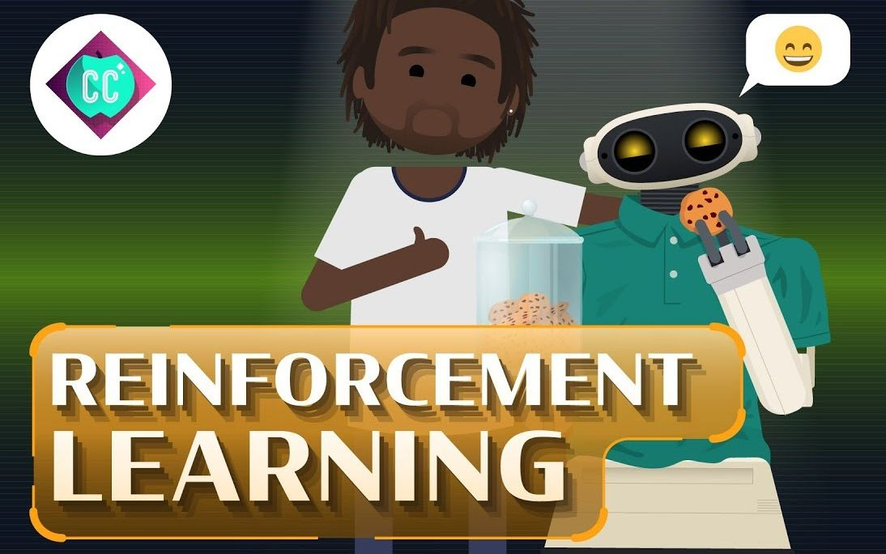

<p align="center">
  
</p>

**[中文](./README.zh-CN.md)** | **[English](./README.md)**

## 简介

欢迎来到我们的GitHub仓库！这个仓库致力于记录 **强化学习** 领域在顶级学术会议，如：**AAAI**, **IJCAI**, **NeurIPS**, **ICML**, **ICLR**, **ICRA**, **AAMAS** 等录用的重要研究论文。我们为您提供了一个便捷的资源库，以帮助您跟踪最新的强化学习进展，深入了解领域内的研究趋势，并探讨最前沿的算法和方法。

## 相关仓库

| 仓库名称                                                     | 备注                                                         |
| ------------------------------------------------------------ | ------------------------------------------------------------ |
| [强化学习论文集（按子方向划分）](https://github.com/Allenpandas/Awesome-Reinforcement-Learning-Papers) | <a href="https://github.com/Allenpandas/Awesome-Reinforcement-Learning-Papers"></a> <a href="https://github.com/Allenpandas/Awesome-Reinforcement-Learning-Papers"></a> <a href="https://github.com/Allenpandas/Awesome-Reinforcement-Learning-Papers"></a> |
| [强化学习入门教程](https://github.com/Allenpandas/Tutorial4RL) | <a href="https://github.com/Allenpandas/Tutorial4RL"></a> <a href="https://github.com/Allenpandas/Tutorial4RL"></a> <a href="https://github.com/Allenpandas/Tutorial4RL"></a> |
| [2023年强化学习方向顶会论文集](https://github.com/Allenpandas/2023-Reinforcement-Learning-Conferences-Papers) | <a href="https://github.com/Allenpandas/2023-Reinforcement-Learning-Conferences-Papers"></a> <a href="https://github.com/Allenpandas/2023-Reinforcement-Learning-Conferences-Papers"></a> <a href="https://github.com/Allenpandas/2023-Reinforcement-Learning-Conferences-Papers"></a> |
| [2022年强化学习方向顶会论文集](https://github.com/Allenpandas/2022-Reinforcement-Learning-Conferences-Papers) | <a href="https://github.com/Allenpandas/2022-Reinforcement-Learning-Conferences-Papers"></a> <a href="https://github.com/Allenpandas/2022-Reinforcement-Learning-Conferences-Papers"></a> <a href="https://github.com/Allenpandas/2022-Reinforcement-Learning-Conferences-Papers"></a> |
| [2021年强化学习方向顶会论文集](https://github.com/Allenpandas/2021-Reinforcement-Learning-Conferences-Papers) | <a href="https://github.com/Allenpandas/2021-Reinforcement-Learning-Conferences-Papers"></a> <a href="https://github.com/Allenpandas/2021-Reinforcement-Learning-Conferences-Papers"></a> <a href="https://github.com/Allenpandas/2021-Reinforcement-Learning-Conferences-Papers"></a> |
| [2020年强化学习方向顶会论文集](https://github.com/Allenpandas/2020-Reinforcement-Learning-Conferences-Papers) | <a href="https://github.com/Allenpandas/2020-Reinforcement-Learning-Conferences-Papers"></a> <a href="https://github.com/Allenpandas/2020-Reinforcement-Learning-Conferences-Papers"></a> <a href="https://github.com/Allenpandas/2020-Reinforcement-Learning-Conferences-Papers"></a> |
| [2019年强化学习方向顶会论文集](https://github.com/Allenpandas/2019-Reinforcement-Learning-Conferences-Papers) | <a href="https://github.com/Allenpandas/2019-Reinforcement-Learning-Conferences-Papers"></a> <a href="https://github.com/Allenpandas/2019-Reinforcement-Learning-Conferences-Papers"></a> <a href="https://github.com/Allenpandas/2019-Reinforcement-Learning-Conferences-Papers"></a> |
| [2018年强化学习方向顶会论文集](https://github.com/Allenpandas/2018-Reinforcement-Learning-Conferences-Papers) | <a href="https://github.com/Allenpandas/2018-Reinforcement-Learning-Conferences-Papers"></a> <a href="https://github.com/Allenpandas/2018-Reinforcement-Learning-Conferences-Papers"></a> <a href="https://github.com/Allenpandas/2018-Reinforcement-Learning-Conferences-Papers"></a> |
| [2017年强化学习方向顶会论文集](https://github.com/Allenpandas/2017-Reinforcement-Learning-Conferences-Papers) | <a href="https://github.com/Allenpandas/2017-Reinforcement-Learning-Conferences-Papers"></a> <a href="https://github.com/Allenpandas/2017-Reinforcement-Learning-Conferences-Papers"></a> <a href="https://github.com/Allenpandas/2017-Reinforcement-Learning-Conferences-Papers"></a> |

## 仓库新闻

- 2023/11/12: I added the related repository.
- 2023/8/19: I added papers accepted at AAMAS'23, IJCAI'23, ICRA'23, ICML'23,ICLR'23, AAAI'23, NeurIPS'22 etc
- 2023/1/6: I created the repository.

## 参与贡献

<p align="center">
  
</p>

**Markdown format：**

```
- **Paper Name**.
  [[pdf](link)]
  [[code](link)]
  - Author 1, Author 2, and Author 3. *conference, year*.
```

请通过联系我或添加拉请求（Pull Request）来帮助贡献此列表。

如有任何问题，请随时与我联系 📮.

## Table of Contents

- [1_多智能体强化学习 (MARL)](#1_Multi-Agent-Reinforcement-Learning)
- [2_元强化学习 (Meta RL)](#2_Meta-Reinforcement-Learning)
- [3_分层强化学习 (HRL)](#3_Hierarchical-Reinforcement-Learning)
- [4_多任务强化学习 (Multi-Task RL)](#4_Multi-Task-Reinforcement-Learning)
- [5_离线强化学习 (Offline RL)](#5_Offline-Reinforcement-Learning)
- [6_逆强化学习 (IRL)](#6_Inverse-Reinforcement-Learning)

### 1_Multi-Agent Reinforcement Learning

- **Online Tuning for Offline Decentralized Multi-Agent Reinforcement Learning.** [[pdf](https://doi.org/10.1609/aaai.v37i7.25973)]
   - Jiechuan Jiang, Zongqing Lu. *AAAI 2023*.
- **Reward Poisoning Attacks on Offline Multi-Agent Reinforcement Learning.** [[pdf](https://doi.org/10.1609/aaai.v37i9.26240)]
   - Young Wu, Jeremy McMahan, Xiaojin Zhu, Qiaomin Xie. *AAAI 2023*.
- **Models as Agents: Optimizing Multi-Step Predictions of Interactive Local Models in Model-Based Multi-Agent Reinforcement Learning.** [[pdf](https://doi.org/10.1609/aaai.v37i9.26241)]
   - Zifan Wu, Chao Yu, Chen Chen, Jianye Hao, Hankz Hankui Zhuo. *AAAI 2023*.
- **DeCOM: Decomposed Policy for Constrained Cooperative Multi-Agent Reinforcement Learning.** [[pdf](https://doi.org/10.1609/aaai.v37i9.26288)]
   - Zhaoxing Yang, Haiming Jin, Rong Ding, Haoyi You, Guiyun Fan, Xinbing Wang, Chenghu Zhou. *AAAI 2023*.
- **Quantum Multi-Agent Meta Reinforcement Learning.** [[pdf](https://doi.org/10.1609/aaai.v37i9.26313)]
   - Won Joon Yun, Jihong Park, Joongheon Kim. *AAAI 2023*.
- **Learning Explicit Credit Assignment for Cooperative Multi-Agent Reinforcement Learning via Polarization Policy Gradient.** [[pdf](https://doi.org/10.1609/aaai.v37i10.26364)]
   - Wubing Chen, Wenbin Li, Xiao Liu, Shangdong Yang, Yang Gao. *AAAI 2023*.
- **Learning from Good Trajectories in Offline Multi-Agent Reinforcement Learning.** [[pdf](https://doi.org/10.1609/aaai.v37i10.26379)]
   - Qi Tian, Kun Kuang, Furui Liu, Baoxiang Wang. *AAAI 2023*.
- **DM²: Decentralized Multi-Agent Reinforcement Learning via Distribution Matching.** [[pdf](https://doi.org/10.1609/aaai.v37i10.26382)]
   - Caroline Wang, Ishan Durugkar, Elad Liebman, Peter Stone. *AAAI 2023*.
-  **Consensus Learning for Cooperative Multi-Agent Reinforcement Learning.** [[pdf](https://doi.org/10.1609/aaai.v37i10.26385)]
      - Zhiwei Xu, Bin Zhang, Dapeng Li, Zeren Zhang, Guangchong Zhou, Hao Chen, Guoliang Fan. *AAAI 2023*.
- **HAVEN: Hierarchical Cooperative Multi-Agent Reinforcement Learning with Dual Coordination Mechanism.** [[pdf](https://doi.org/10.1609/aaai.v37i10.26386)]
   - Zhiwei Xu, Yunpeng Bai, Bin Zhang, Dapeng Li, Guoliang Fan. *AAAI 2023*.
- **DACOM: Learning Delay-Aware Communication for Multi-Agent Reinforcement Learning.** [[pdf](https://doi.org/10.1609/aaai.v37i10.26389)]
   - Tingting Yuan, Hwei-Ming Chung, Jie Yuan, Xiaoming Fu. *AAAI 2023*.
- **Certified Policy Smoothing for Cooperative Multi-Agent Reinforcement Learning.** [[pdf](https://doi.org/10.1609/aaai.v37i12.26756)]
   - Ronghui Mu, Wenjie Ruan, Leandro Soriano Marcolino, Gaojie Jin, Qiang Ni. *AAAI 2023*.
- **Enhancing Smart, Sustainable Mobility with Game Theory and Multi-Agent Reinforcement Learning With Applications to Ridesharing.** [[pdf](https://doi.org/10.1609/aaai.v37i13.26917)]
   - Lucia Cipolina-Kun. *AAAI 2023*.
- **Tackling Safe and Efficient Multi-Agent Reinforcement Learning via Dynamic Shielding (Student Abstract).** [[pdf](https://doi.org/10.1609/aaai.v37i13.27041)]
   - Wenli Xiao, Yiwei Lyu, John M. Dolan. *AAAI 2023*.
- **Multi-Agent Reinforcement Learning for Adaptive Mesh Refinement.** [[pdf](https://dl.acm.org/doi/10.5555/3545946.3598614)]
   - Jiachen Yang, Ketan Mittal, Tarik Dzanic, Socratis Petrides, Brendan Keith, Brenden K. Petersen, Daniel M. Faissol, Robert W. Anderson. *AAMAS 2023*.
- **Adaptive Learning Rates for Multi-Agent Reinforcement Learning.** [[pdf](https://dl.acm.org/doi/10.5555/3545946.3598615)]
   - Jiechuan Jiang, Zongqing Lu. *AAMAS 2023*.
- **Adaptive Value Decomposition with Greedy Marginal Contribution Computation for Cooperative Multi-Agent Reinforcement Learning.** [[pdf](https://dl.acm.org/doi/10.5555/3545946.3598616)]
   - Shanqi Liu, Yujing Hu, Runze Wu, Dong Xing, Yu Xiong, Changjie Fan, Kun Kuang, Yong Liu. *AAMAS 2023*.
- **A Variational Approach to Mutual Information-Based Coordination for Multi-Agent Reinforcement Learning.** [[pdf](https://dl.acm.org/doi/10.5555/3545946.3598617)]
   - Woojun Kim, Whiyoung Jung, Myungsik Cho, Youngchul Sung. *AAMAS 2023*.
- **Mediated Multi-Agent Reinforcement Learning.** [[pdf](https://dl.acm.org/doi/10.5555/3545946.3598618)]
   - Dmitry Ivanov, Ilya Zisman, Kirill Chernyshev. *AAMAS 2023*.
- **EXPODE: EXploiting POlicy Discrepancy for Efficient Exploration in Multi-agent Reinforcement Learning.** [[pdf](https://dl.acm.org/doi/10.5555/3545946.3598619)]
   - Yucong Zhang, Chao Yu. *AAMAS 2023*.
 - **AC2C: Adaptively Controlled Two-Hop Communication for Multi-Agent Reinforcement Learning.** [[pdf](https://dl.acm.org/doi/10.5555/3545946.3598667)]
   - Xuefeng Wang, Xinran Li, Jiawei Shao, Jun Zhang. *AAMAS 2023*.
 - **Learning Structured Communication for Multi-Agent Reinforcement Learning.** [[pdf](https://dl.acm.org/doi/10.5555/3545946.3598668)]
   - Junjie Sheng, Xiangfeng Wang, Bo Jin, Wenhao Li, Jun Wang, Junchi Yan, Tsung-Hui Chang, Hongyuan Zha. *AAMAS 2023*.
 - **Model-based Sparse Communication in Multi-agent Reinforcement Learning.** [[pdf](https://dl.acm.org/doi/10.5555/3545946.3598669)]
   - Shuai Han, Mehdi Dastani, Shihan Wang. *AAMAS 2023*.
 - **Sequential Cooperative Multi-Agent Reinforcement Learning.** [[pdf](https://dl.acm.org/doi/10.5555/3545946.3598674)]
   - Yifan Zang, Jinmin He, Kai Li, Haobo Fu, Qiang Fu, Junliang Xing. *AAMAS 2023*.
 - **Asynchronous Multi-Agent Reinforcement Learning for Efficient Real-Time Multi-Robot Cooperative Exploration.** [[pdf](https://dl.acm.org/doi/10.5555/3545946.3598752)]
   - Chao Yu, Xinyi Yang, Jiaxuan Gao, Jiayu Chen, Yunfei Li, Jijia Liu, Yunfei Xiang, Ruixin Huang, Huazhong Yang, Yi Wu, Yu Wang. *AAMAS 2023*.
 - **Learning from Multiple Independent Advisors in Multi-agent Reinforcement Learning.** [[pdf](https://dl.acm.org/doi/10.5555/3545946.3598756)]
   - Sriram Ganapathi Subramanian, Matthew E. Taylor, Kate Larson, Mark Crowley. *AAMAS 2023*.
 - **CraftEnv: A Flexible Collective Robotic Construction Environment for Multi-Agent Reinforcement Learning.** [[pdf](https://dl.acm.org/doi/10.5555/3545946.3598759)]
   - Rui Zhao, Xu Liu, Yizheng Zhang, Minghao Li, Cheng Zhou, Shuai Li, Lei Han. *AAMAS 2023*.
 - **Multi-Agent Reinforcement Learning with Safety Layer for Active Voltage Control.** [[pdf](https://dl.acm.org/doi/10.5555/3545946.3598807)]
   - Yufeng Shi, Mingxiao Feng, Minrui Wang, Wengang Zhou, Houqiang Li. *AAMAS 2023*.
 - **Model-based Dynamic Shielding for Safe and Efficient Multi-agent Reinforcement Learning.** [[pdf](https://dl.acm.org/doi/10.5555/3545946.3598814)]
   - Wenli Xiao, Yiwei Lyu, John M. Dolan. *AAMAS 2023*.
 - **Toward Risk-based Optimistic Exploration for Cooperative Multi-Agent Reinforcement Learning.** [[pdf](https://dl.acm.org/doi/10.5555/3545946.3598815)]
   - Jihwan Oh, Joonkee Kim, Minchan Jeong, Se-Young Yun. *AAMAS 2023*.
 - **Counterexample-Guided Policy Refinement in Multi-Agent Reinforcement Learning.** [[pdf](https://dl.acm.org/doi/10.5555/3545946.3598816)]
   - Briti Gangopadhyay, Pallab Dasgupta, Soumyajit Dey. *AAMAS 2023*.
 - **Prioritized Tasks Mining for Multi-Task Cooperative Multi-Agent Reinforcement Learning.** [[pdf](https://dl.acm.org/doi/10.5555/3545946.3598817)]
   - Yang Yu, Qiyue Yin, Junge Zhang, Kaiqi Huang. *AAMAS 2023*.
 - **TransfQMix: Transformers for Leveraging the Graph Structure of Multi-Agent Reinforcement Learning Problems.** [[pdf](https://dl.acm.org/doi/10.5555/3545946.3598825)]
   - Matteo Gallici, Mario Martin, Ivan Masmitja. *AAMAS 2023*.
 - **Parameter Sharing with Network Pruning for Scalable Multi-Agent Deep Reinforcement Learning.** [[pdf](https://dl.acm.org/doi/10.5555/3545946.3598863)]
   - Woojun Kim, Youngchul Sung. *AAMAS 2023*.
 - **Towards Explaining Sequences of Actions in Multi-Agent Deep Reinforcement Learning Models.** [[pdf](https://dl.acm.org/doi/10.5555/3545946.3598922)]
   - Khaing Phyo Wai, Minghong Geng, Budhitama Subagdja, Shubham Pateria, Ah-Hwee Tan. *AAMAS 2023*.
 - **Multi-Agent Deep Reinforcement Learning for High-Frequency Multi-Market Making.** [[pdf](https://dl.acm.org/doi/10.5555/3545946.3598950)]
   - Pankaj Kumar. *AAMAS 2023*.
 -  **Learning Individual Difference Rewards in Multi-Agent Reinforcement Learning.** [[pdf](https://dl.acm.org/doi/10.5555/3545946.3598953)]
      - Chen Yang, Guangkai Yang, Junge Zhang. *AAMAS 2023*.
 - **Off-Beat Multi-Agent Reinforcement Learning.** [[pdf](https://dl.acm.org/doi/10.5555/3545946.3598955)]
   - Wei Qiu, Weixun Wang, Rundong Wang, Bo An, Yujing Hu, Svetlana Obraztsova, Zinovi Rabinovich, Jianye Hao, Yingfeng Chen, Changjie Fan. *AAMAS 2023*.
 - **Selectively Sharing Experiences Improves Multi-Agent Reinforcement Learning.** [[pdf](https://dl.acm.org/doi/10.5555/3545946.3598958)]
   - Matthias Gerstgrasser, Tom Danino, Sarah Keren. *AAMAS 2023*.
 - **Off-the-Grid MARL: Datasets and Baselines for Offline Multi-Agent Reinforcement Learning.** [[pdf](https://dl.acm.org/doi/10.5555/3545946.3598961)]
   - Claude Formanek, Asad Jeewa, Jonathan P. Shock, Arnu Pretorius. *AAMAS 2023*.
 - **Grey-box Adversarial Attack on Communication in Multi-agent Reinforcement Learning.** [[pdf](https://dl.acm.org/doi/10.5555/3545946.3598963)]
   - Xiao Ma, Wu-Jun Li. *AAMAS 2023*.
 - **Multi-Agent Reinforcement Learning for Fast-Timescale Demand Response of Residential Loads.** [[pdf](https://dl.acm.org/doi/10.5555/3545946.3598982)]
   - Vincent Mai, Philippe Maisonneuve, Tianyu Zhang, Hadi Nekoei, Liam Paull, Antoine Lesage-Landry. *AAMAS 2023*.
 - **Learning to Self-Reconfigure for Freeform Modular Robots via Altruism Multi-Agent Reinforcement Learning.** [[pdf](https://dl.acm.org/doi/10.5555/3545946.3598996)]
   - Lei Wu, Bin Guo, Qiuyun Zhang, Zhuo Sun, Jieyi Zhang, Zhiwen Yu. *AAMAS 2023*.
 - **Multi-Agent Path Finding via Reinforcement Learning with Hybrid Reward.** [[pdf](https://dl.acm.org/doi/10.5555/3545946.3599007)]
   - Cheng Zhao, Liansheng Zhuang, Haonan Liu, Yihong Huang, Jian Yang. *AAMAS 2023*.
 - **Learning Solutions in Large Economic Networks using Deep Multi-Agent Reinforcement Learning.** [[pdf](https://dl.acm.org/doi/10.5555/3545946.3599069)]
   - Michael Curry, Alexander Trott, Soham Phade, Yu Bai, Stephan Zheng. *AAMAS 2023*.
 - **Offline Multi-Agent Reinforcement Learning with Coupled Value Factorization.** [[pdf](https://dl.acm.org/doi/10.5555/3545946.3599076)]
   - Xiangsen Wang, Xianyuan Zhan. *AAMAS 2023*.
 - **Causality Detection for Efficient Multi-Agent Reinforcement Learning.** [[pdf](https://dl.acm.org/doi/10.5555/3545946.3599091)]
   - Rafael Pina, Varuna De Silva, Corentin Artaud. *AAMAS 2023*.
 - **Attention-Based Recurrency for Multi-Agent Reinforcement Learning under State Uncertainty.** [[pdf](https://dl.acm.org/doi/10.5555/3545946.3599096)]
   - Thomy Phan, Fabian Ritz, Jonas Nüßlein, Michael Kölle, Thomas Gabor, Claudia Linnhoff-Popien. *AAMAS 2023*.
 - **Fair Transport Network Design using Multi-Agent Reinforcement Learning.** [[pdf](https://dl.acm.org/doi/10.5555/3545946.3599149)]
   - Dimitris Michailidis. *AAMAS 2023*.
 - **Reinforcement Learning in Multi-Objective Multi-Agent Systems.** [[pdf](https://dl.acm.org/doi/10.5555/3545946.3599151)]
   - Willem Röpke. *AAMAS 2023*.
 - **Enhancing Smart, Sustainable Mobility with Game Theory and Multi-Agent Reinforcement Learning.** [[pdf](https://dl.acm.org/doi/10.5555/3545946.3599163)]
   - Lucia Cipolina-Kun. *AAMAS 2023*.
 - **Stateful Active Facilitator: Coordination and Environmental Heterogeneity in Cooperative Multi-Agent Reinforcement Learning.** [[pdf](https://openreview.net/pdf?id=B4maZQLLW0_)]
   - Dianbo Liu, Vedant Shah, Oussama Boussif, Cristian Meo, Anirudh Goyal, Tianmin Shu, Michael Curtis Mozer, Nicolas Heess, Yoshua Bengio. *ICLR 2023*.
 -  **MACTA: A Multi-agent Reinforcement Learning Approach for Cache Timing Attacks and Detection.** [[pdf](https://openreview.net/pdf?id=CDlHZ78-Xzi)]
      - Jiaxun Cui, Xiaomeng Yang, Mulong Luo, Geunbae Lee, Peter Stone, Hsien-Hsin S. Lee, Benjamin Lee, G. Edward Suh, Wenjie Xiong, Yuandong Tian. *ICLR 2023*.
 - **MAESTRO: Open-Ended Environment Design for Multi-Agent Reinforcement Learning.** [[pdf](https://openreview.net/pdf?id=sKWlRDzPfd7)]
   - Mikayel Samvelyan, Akbir Khan, Michael Dennis, Minqi Jiang, Jack Parker-Holder, Jakob Nicolaus Foerster, Roberta Raileanu, Tim Rocktäschel. *ICLR 2023*.
 - **Scaling Laws for a Multi-Agent Reinforcement Learning Model.** [[pdf](https://openreview.net/pdf?id=ZrEbzL9eQ3W)]
   - Oren Neumann, Claudius Gros. *ICLR 2023*.
 - **RPM: Generalizable Multi-Agent Policies for Multi-Agent Reinforcement Learning.** [[pdf](https://openreview.net/pdf?id=HnSceSzlfrY)]
   - Wei Qiu, Xiao Ma, Bo An, Svetlana Obraztsova, Shuicheng Yan, Zhongwen Xu. *ICLR 2023*.
 - **Cheap Talk Discovery and Utilization in Multi-Agent Reinforcement Learning.** [[pdf](https://openreview.net/pdf?id=cddbeL1HWaD)]
   - Yat Long Lo, Christian Schröder de Witt, Samuel Sokota, Jakob Nicolaus Foerster, Shimon Whiteson. *ICLR 2023*.
 - **Order Matters: Agent-by-agent Policy Optimization.** [[pdf](https://openreview.net/pdf?id=Q-neeWNVv1)]
   - Xihuai Wang, Zheng Tian, Ziyu Wan, Ying Wen, Jun Wang, Weinan Zhang. *ICLR 2023*.

 - **Context-Aware Bayesian Network Actor-Critic Methods for Cooperative Multi-Agent Reinforcement Learning.** [[pdf](https://proceedings.mlr.press/v202/chen23an.html)]
   - Dingyang Chen, Qi Zhang. *ICML 2023*.
 - **Entity Divider with Language Grounding in Multi-Agent Reinforcement Learning.** [[pdf](https://proceedings.mlr.press/v202/ding23d.html)]
      - Ziluo Ding, Wanpeng Zhang, Junpeng Yue, Xiangjun Wang, Tiejun Huang, Zongqing Lu. *ICML 2023*.
 - **Oracles & Followers: Stackelberg Equilibria in Deep Multi-Agent Reinforcement Learning.** [[pdf](https://proceedings.mlr.press/v202/gerstgrasser23a.html)]
   - Matthias Gerstgrasser, David C. Parkes. *ICML 2023*.
 - **An Adaptive Entropy-Regularization Framework for Multi-Agent Reinforcement Learning.** [[pdf](https://proceedings.mlr.press/v202/kim23v.html)]
   - Woojun Kim, Youngchul Sung. *ICML 2023*.
 - **RACE: Improve Multi-Agent Reinforcement Learning with Representation Asymmetry and Collaborative Evolution.** [[pdf](https://proceedings.mlr.press/v202/li23i.html)]
   - Pengyi Li, Jianye Hao, Hongyao Tang, Yan Zheng, Xian Fu. *ICML 2023*.
 - **Lazy Agents: A New Perspective on Solving Sparse Reward Problem in Multi-agent Reinforcement Learning.** [[pdf](https://proceedings.mlr.press/v202/liu23ac.html)]
   - Boyin Liu, Zhiqiang Pu, Yi Pan, Jianqiang Yi, Yanyan Liang, Du Zhang. *ICML 2023*.
 - **Cooperative Multi-Agent Reinforcement Learning: Asynchronous Communication and Linear Function Approximation.** [[pdf](https://proceedings.mlr.press/v202/min23a.html)]
   - Yifei Min, Jiafan He, Tianhao Wang, Quanquan Gu. *ICML 2023*.
 - **Scalable Multi-Agent Reinforcement Learning through Intelligent Information Aggregation.** [[pdf](https://proceedings.mlr.press/v202/nayak23a.html)]
   - Siddharth Nayak, Kenneth Choi, Wenqi Ding, Sydney Dolan, Karthik Gopalakrishnan, Hamsa Balakrishnan. *ICML 2023*.
 - **Attention-Based Recurrence for Multi-Agent Reinforcement Learning under Stochastic Partial Observability.** [[pdf](https://proceedings.mlr.press/v202/phan23a.html)]
      - Thomy Phan, Fabian Ritz, Philipp Altmann, Maximilian Zorn, Jonas Nüßlein, Michael Kölle, Thomas Gabor, Claudia Linnhoff-Popien. *ICML 2023*.
 - **Complementary Attention for Multi-Agent Reinforcement Learning.** [[pdf](https://proceedings.mlr.press/v202/shao23b.html)]
   - Jianzhun Shao, Hongchang Zhang, Yun Qu, Chang Liu, Shuncheng He, Yuhang Jiang, Xiangyang Ji. *ICML 2023*.
 - **Local Optimization Achieves Global Optimality in Multi-Agent Reinforcement Learning.** [[pdf](https://proceedings.mlr.press/v202/zhao23j.html)]
   - Yulai Zhao, Zhuoran Yang, Zhaoran Wang, Jason D. Lee. *ICML 2023*.
 - **Multi-Target Pursuit by a Decentralized Heterogeneous UAV Swarm using Deep Multi-Agent Reinforcement Learning.** [[pdf](https://doi.org/10.1109/ICRA48891.2023.10160919)]
   - Maryam Kouzeghar, Youngbin Song, Malika Meghjani, Roland Bouffanais. *ICRA 2023*.
 - **Explainable Action Advising for Multi-Agent Reinforcement Learning.** [[pdf](https://doi.org/10.1109/ICRA48891.2023.10160557)]
   - Yue Guo, Joseph Campbell, Simon Stepputtis, Ruiyu Li, Dana Hughes, Fei Fang, Katia P. Sycara. *ICRA 2023*.
 - **Spatial-Temporal-Aware Safe Multi-Agent Reinforcement Learning of Connected Autonomous Vehicles in Challenging Scenarios.** [[pdf](https://doi.org/10.1109/ICRA48891.2023.10161216)]
   - Zhili Zhang, Songyang Han, Jiangwei Wang, Fei Miao. *ICRA 2023*.
 - **Conflict-constrained Multi-agent Reinforcement Learning Method for Parking Trajectory Planning.** [[pdf](https://doi.org/10.1109/ICRA48891.2023.10160698)]
   - Siyuan Chen, Meiling Wang, Yi Yang, Wenjie Song. *ICRA 2023*.
 - **Explainable Multi-Agent Reinforcement Learning for Temporal Queries.** [[pdf](https://doi.org/10.24963/ijcai.2023/7)]
   - Kayla Boggess, Sarit Kraus, Lu Feng. *IJCAI 2023*.
 - **Scalable Communication for Multi-Agent Reinforcement Learning via Transformer-Based Email Mechanism.** [[pdf](https://doi.org/10.24963/ijcai.2023/15)]
      - Xudong Guo, Daming Shi, Wenhui Fan. *IJCAI 2023*.
 - **Learning to Send Reinforcements: Coordinating Multi-Agent Dynamic Police Patrol Dispatching and Rescheduling via Reinforcement Learning.** [[pdf](https://doi.org/10.24963/ijcai.2023/18)]
   - Waldy Joe, Hoong Chuin Lau. *IJCAI 2023*.
 - **Decentralized Anomaly Detection in Cooperative Multi-Agent Reinforcement Learning.** [[pdf](https://doi.org/10.24963/ijcai.2023/19)]
   - Kiarash Kazari, Ezzeldin Shereen, György Dán. *IJCAI 2023*.
 - **GPLight: Grouped Multi-agent Reinforcement Learning for Large-scale Traffic Signal Control.** [[pdf](https://doi.org/10.24963/ijcai.2023/23)]
   - Yilin Liu, Guiyang Luo, Quan Yuan, Jinglin Li, Lei Jin, Bo Chen, Rui Pan. *IJCAI 2023*.
 - **Deep Hierarchical Communication Graph in Multi-Agent Reinforcement Learning.** [[pdf](https://doi.org/10.24963/ijcai.2023/24)]
   - Zeyang Liu, Lipeng Wan, Xue Sui, Zhuoran Chen, Kewu Sun, Xuguang Lan. *IJCAI 2023*.
 - **Modeling Moral Choices in Social Dilemmas with Multi-Agent Reinforcement Learning.** [[pdf](https://doi.org/10.24963/ijcai.2023/36)]
   - Elizaveta Tennant, Stephen Hailes, Mirco Musolesi. *IJCAI 2023*.
 - **Inducing Stackelberg Equilibrium through Spatio-Temporal Sequential Decision-Making in Multi-Agent Reinforcement Learning.** [[pdf](https://doi.org/10.24963/ijcai.2023/40)]
   - Bin Zhang, Lijuan Li, Zhiwei Xu, Dapeng Li, Guoliang Fan. *IJCAI 2023*.
 - **Self-Supervised Neuron Segmentation with Multi-Agent Reinforcement Learning.** [[pdf](https://doi.org/10.24963/ijcai.2023/68)]
   - Yinda Chen, Wei Huang, Shenglong Zhou, Qi Chen, Zhiwei Xiong. *IJCAI 2023*.
 - **MA2CL: Masked Attentive Contrastive Learning for Multi-Agent Reinforcement Learning.** [[pdf](https://doi.org/10.24963/ijcai.2023/470)]
   - Haolin Song, Mingxiao Feng, Wengang Zhou, Houqiang Li. *IJCAI 2023*.
 - **Competitive-Cooperative Multi-Agent Reinforcement Learning for Auction-based Federated Learning.** [[pdf](https://doi.org/10.24963/ijcai.2023/474)]
   - Xiaoli Tang, Han Yu. *IJCAI 2023*.
 - **DPMAC: Differentially Private Communication for Cooperative Multi-Agent Reinforcement Learning.** [[pdf](https://doi.org/10.24963/ijcai.2023/516)]
   - Canzhe Zhao, Yanjie Ze, Jing Dong, Baoxiang Wang, Shuai Li. *IJCAI 2023*.

### 2_Meta Reinforcement Learning

- **Meta-Reinforcement Learning Based on Self-Supervised Task Representation Learning.** [[pdf](https://doi.org/10.1609/aaai.v37i8.26210)]
   - Mingyang Wang, Zhenshan Bing, Xiangtong Yao, Shuai Wang, Kai Huang, Hang Su, Chenguang Yang, Alois Knoll. *AAAI 2023*.
- **Quantum Multi-Agent Meta Reinforcement Learning.** [[pdf](https://doi.org/10.1609/aaai.v37i9.26313)]
   - Won Joon Yun, Jihong Park, Joongheon Kim. *AAAI 2023*.
- **A CMDP-within-online framework for Meta-Safe Reinforcement Learning.** [[pdf](https://openreview.net/pdf?id=mbxz9Cjehr)]
   - Vanshaj Khattar, Yuhao Ding, Bilgehan Sel, Javad Lavaei, Ming Jin. *ICLR 2023*.
-  **Distributional Meta-Gradient Reinforcement Learning.** [[pdf](https://openreview.net/pdf?id=LGkmUauBUL)]
      - Haiyan Yin, Shuicheng Yan, Zhongwen Xu. *ICLR 2023*.
- **Simple Embodied Language Learning as a Byproduct of Meta-Reinforcement Learning.** [[pdf](https://proceedings.mlr.press/v202/liu23af.html)]
   - Evan Zheran Liu, Sahaana Suri, Tong Mu, Allan Zhou, Chelsea Finn. *ICML 2023*.
- **Offline Meta Reinforcement Learning with In-Distribution Online Adaptation.** [[pdf](https://proceedings.mlr.press/v202/wang23au.html)]
   - Jianhao Wang, Jin Zhang, Haozhe Jiang, Junyu Zhang, Liwei Wang, Chongjie Zhang. *ICML 2023*.
- **Meta-Reinforcement Learning via Language Instructions.** [[pdf](https://doi.org/10.1109/ICRA48891.2023.10160626)]
   - Zhenshan Bing, Alexander W. Koch, Xiangtong Yao, Kai Huang, Alois Knoll. *ICRA 2023*.
- **Zero-Shot Policy Transfer with Disentangled Task Representation of Meta-Reinforcement Learning.** [[pdf](https://doi.org/10.1109/ICRA48891.2023.10160764)]
   - Zheng Wu, Yichen Xie, Wenzhao Lian, Changhao Wang, Yanjiang Guo, Jianyu Chen, Stefan Schaal, Masayoshi Tomizuka. *ICRA 2023*.

### 3_Hierarchical Reinforcement Learning

 - **HAVEN: Hierarchical Cooperative Multi-Agent Reinforcement Learning with Dual Coordination Mechanism.** [[pdf](https://doi.org/10.1609/aaai.v37i10.26386)]
   - Zhiwei Xu, Yunpeng Bai, Bin Zhang, Dapeng Li, Guoliang Fan. *AAAI 2023*.
 - **Hierarchical Mean-Field Deep Reinforcement Learning for Large-Scale Multiagent Systems.** [[pdf](https://doi.org/10.1609/aaai.v37i10.26387)]
   - Chao Yu. *AAAI 2023*.
 - **Hierarchical Reinforcement Learning with Human-AI Collaborative Sub-Goals Optimization.** [[pdf](https://dl.acm.org/doi/10.5555/3545946.3598917)]
   - Haozhe Ma, Thanh Vinh Vo, Tze-Yun Leong. *AAMAS 2023*.
 - **Hierarchical Reinforcement Learning for Ad Hoc Teaming.** [[pdf](https://dl.acm.org/doi/10.5555/3545946.3598926)]
   - Stéphane Aroca-Ouellette, Miguel Aroca-Ouellette, Upasana Biswas, Katharina Kann, Alessandro Roncone. *AAMAS 2023*.
 - **Matching Options to Tasks using Option-Indexed Hierarchical Reinforcement Learning.** [[pdf](https://dl.acm.org/doi/10.5555/3545946.3599025)]
   - Kushal Chauhan, Soumya Chatterjee, Akash Reddy, Aniruddha S, Balaraman Ravindran, Pradeep Shenoy. *AAMAS 2023*.
 - **Hierarchical Reinforcement Learning with Attention Reward.** [[pdf](https://dl.acm.org/doi/10.5555/3545946.3599084)]
   - Sihong Luo, Jinghao Chen, Zheng Hu, Chunhong Zhang, Benhui Zhuang. *AAMAS 2023*.
 - **Hierarchical Programmatic Reinforcement Learning via Learning to Compose Programs.** [[pdf](https://proceedings.mlr.press/v202/liu23p.html)]
   - Guan-Ting Liu, En-Pei Hu, Pu-Jen Cheng, Hung-Yi Lee, Shao-Hua Sun. *ICML 2023*.
 - **Adaptive and Explainable Deployment of Navigation Skills via Hierarchical Deep Reinforcement Learning.** [[pdf](https://doi.org/10.1109/ICRA48891.2023.10160371)]
   - Kyowoon Lee, Seongun Kim, Jaesik Choi. *ICRA 2023*.

### 4_Multi-Task Rinforcement Learning

- **PiCor: Multi-Task Deep Reinforcement Learning with Policy Correction.** [[pdf](https://doi.org/10.1609/aaai.v37i6.25825)]
   - Fengshuo Bai, Hongming Zhang, Tianyang Tao, Zhiheng Wu, Yanna Wang, Bo Xu. *AAAI 2023*.
- **Prioritized Tasks Mining for Multi-Task Cooperative Multi-Agent Reinforcement Learning.** [[pdf](https://dl.acm.org/doi/10.5555/3545946.3598817)]
   - Yang Yu, Qiyue Yin, Junge Zhang, Kaiqi Huang. *AAMAS 2023*.
- **Investigating Multi-task Pretraining and Generalization in Reinforcement Learning.** [[pdf](https://openreview.net/pdf?id=sSt9fROSZRO)]
   - Adrien Ali Taïga, Rishabh Agarwal, Jesse Farebrother, Aaron C. Courville, Marc G. Bellemare. *ICLR 2023*.
- **Demonstration-Bootstrapped Autonomous Practicing via Multi-Task Reinforcement Learning.** [[pdf](https://doi.org/10.1109/ICRA48891.2023.10161447)]
   - Abhishek Gupta, Corey Lynch, Brandon Kinman, Garrett Peake, Sergey Levine, Karol Hausman. *ICRA 2023*.

### 5_Offline Reinforcement Learning

- **Offline Quantum Reinforcement Learning in a Conservative Manner.** [[pdf](https://doi.org/10.1609/aaai.v37i6.25872)]
  - Zhihao Cheng, Kaining Zhang, Li Shen, Dacheng Tao. *AAAI Conference on Artificial Intelligence (AAAI 2023).* 
 - **On the Sample Complexity of Vanilla Model-Based Offline Reinforcement Learning with Dependent Samples.** [[pdf](https://doi.org/10.1609/aaai.v37i7.25989)]
   - Mustafa O. Karabag, Ufuk Topcu. *AAAI Conference on Artificial Intelligence (AAAI 2023).* 

### 6_Inverse Reinforcement Learning

- **Misspecification in Inverse Reinforcement Learning.** [[pdf](https://doi.org/10.1609/aaai.v37i12.26766)]
   - Joar Skalse, Alessandro Abate. *AAAI 2023*.
- **Multiagent Inverse Reinforcement Learning via Theory of Mind Reasoning.** [[pdf](https://dl.acm.org/doi/10.5555/3545946.3598703)]
   - Haochen Wu, Pedro Sequeira, David V. Pynadath. *AAMAS 2023*.
- **Adversarial Inverse Reinforcement Learning for Mean Field Games.** [[pdf](https://dl.acm.org/doi/10.5555/3545946.3598749)]
   - Yang Chen, Libo Zhang, Jiamou Liu, Michael Witbrock. *AAMAS 2023*.
- **LTL-Based Non-Markovian Inverse Reinforcement Learning.** [[pdf](https://dl.acm.org/doi/10.5555/3545946.3599102)]
   - Mohammad Afzal, Sankalp Gambhir, Ashutosh Gupta, S. Krishna, Ashutosh Trivedi, Alvaro Velasquez. *AAMAS 2023*.
- **LS-IQ: Implicit Reward Regularization for Inverse Reinforcement Learning.** [[pdf](https://openreview.net/pdf?id=o3Q4m8jg4BR)]
   - Firas Al-Hafez, Davide Tateo, Oleg Arenz, Guoping Zhao, Jan Peters. *ICLR 2023*.
- **Causal Imitation Learning via Inverse Reinforcement Learning.** [[pdf](https://openreview.net/pdf?id=B-z41MBL_tH)]
   - Kangrui Ruan, Junzhe Zhang, Xuan Di, Elias Bareinboim. *ICLR 2023*.
- **Benchmarking Constraint Inference in Inverse Reinforcement Learning.** [[pdf](https://openreview.net/pdf?id=vINj_Hv9szL)]
   - Guiliang Liu, Yudong Luo, Ashish Gaurav, Kasra Rezaee, Pascal Poupart. *ICLR 2023*.
- **CLARE: Conservative Model-Based Reward Learning for Offline Inverse Reinforcement Learning.** [[pdf](https://openreview.net/pdf?id=5aT4ganOd98)]
   - Sheng Yue, Guanbo Wang, Wei Shao, Zhaofeng Zhang, Sen Lin, Ju Ren, Junshan Zhang. *ICLR 2023*.
- **Multi-task Hierarchical Adversarial Inverse Reinforcement Learning.** [[pdf](https://proceedings.mlr.press/v202/chen23x.html)]
   - Jiayu Chen, Dipesh Tamboli, Tian Lan, Vaneet Aggarwal. *ICML 2023*.
- **Towards Theoretical Understanding of Inverse Reinforcement Learning.** [[pdf](https://proceedings.mlr.press/v202/metelli23a.html)]
   - Alberto Maria Metelli, Filippo Lazzati, Marcello Restelli. *ICML 2023*.
- **Identifiability and Generalizability in Constrained Inverse Reinforcement Learning.** [[pdf](https://proceedings.mlr.press/v202/schlaginhaufen23a.html)]
   - Andreas Schlaginhaufen, Maryam Kamgarpour. *ICML 2023*.
- **Inverse Reinforcement Learning without Reinforcement Learning.** [[pdf](https://proceedings.mlr.press/v202/swamy23a.html)]
   - Gokul Swamy, David Wu, Sanjiban Choudhury, Drew Bagnell, Zhiwei Steven Wu. *ICML 2023*.
- **Inverse Reinforcement Learning Framework for Transferring Task Sequencing Policies from Humans to Robots in Manufacturing Applications.** [[pdf](https://doi.org/10.1109/ICRA48891.2023.10160687)]
   - Omey M. Manyar, Zachary McNulty, Stefanos Nikolaidis, Satyandra K. Gupta. *ICRA 2023*.
- **Learning Risk-Aware Costmaps via Inverse Reinforcement Learning for Off-Road Navigation.** [[pdf](https://doi.org/10.1109/ICRA48891.2023.10161268)]
   - Samuel Triest, Mateo Guaman Castro, Parv Maheshwari, Matthew Sivaprakasam, Wenshan Wang, Sebastian A. Scherer. *ICRA 2023*.
- **DriveIRL: Drive in Real Life with Inverse Reinforcement Learning.** [[pdf](https://doi.org/10.1109/ICRA48891.2023.10160449)]
   - Tung Phan-Minh, Forbes Howington, Ting-Sheng Chu, Momchil S. Tomov, Robert E. Beaudoin, Sang Uk Lee, Nanxiang Li, Caglayan Dicle, Samuel Findler, Francisco Suárez-Ruiz, Bo Yang, Sammy Omari, Eric M. Wolff. *ICRA 2023*.
- **Show me What you want: Inverse Reinforcement Learning to Automatically Design Robot Swarms by Demonstration.** [[pdf](https://doi.org/10.1109/ICRA48891.2023.10160947)]
   - Ilyes Gharbi, Jonas Kuckling, David Garzón-Ramos, Mauro Birattari. *ICRA 2023*.
- **Option-Aware Adversarial Inverse Reinforcement Learning for Robotic Control.** [[pdf](https://doi.org/10.1109/ICRA48891.2023.10160374)]
   - Jiayu Chen, Tian Lan, Vaneet Aggarwal. *ICRA 2023*.
- **SoLo T-DIRL: Socially-Aware Dynamic Local Planner based on Trajectory-Ranked Deep Inverse Reinforcement Learning.** [[pdf](https://doi.org/10.1109/ICRA48891.2023.10160536)]
   - Yifan Xu, Theodor Chakhachiro, Tribhi Kathuria, Maani Ghaffari. *ICRA 2023*.
- **InitLight: Initial Model Generation for Traffic Signal Control Using Adversarial Inverse Reinforcement Learning.** [[pdf](https://doi.org/10.24963/ijcai.2023/550)]
   - Yutong Ye, Yingbo Zhou, Jiepin Ding, Ting Wang, Mingsong Chen, Xiang Lian. *IJCAI 2023*.

## 引用

如果你在你的研究中使用这个工具箱，请引用这个项目。

```
@misc{YalunAwesome,
    author = {Yalun Wu},
    title = {Awesome-Reinforcement-Learning-Papers},
    year = {2023},
    howpublished = {\url{https://github.com/Allenpandas/Awesome-Reinforcement-Learning-Papers}}
}
```

## Star History

[](https://star-history.com/#Allenpandas/Awesome-Reinforcement-Learning-Papers&Date)
